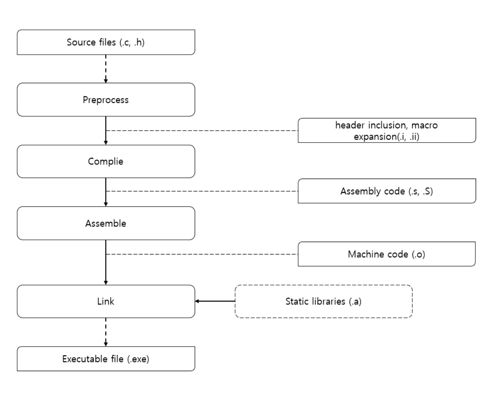

# Compile Sequence

# 목차

## 컴파일 정의

## 컴파일 전체 진행과정(in C/C++)

## Github 질문

---

## 컴파일 정의

정의 : 고수준 언어를 저수준 언어로 변환하는 일련의 과정을 총칭하는 말

고수준 언어 : 인간이 이해할 수 있는 언어(High-level Language)

e.g., C/C++, Java, etc.

저수준 언어 : 기계가 이해할 수 있는 언어(Low-level Language)

e.g., Assembly, Machine Code

목적 : 프로그래밍 언어는 프로그래머의 개발 편의를 위해 인간이 이해하고 표현하기 쉬운 언어로 작성되었고, 기계어는 명령어 집합(ISA : Instruction Set Architecture) 으로만 동작하므로 중간 변역 과정이 필요함.

이를 수행해주는 개체를 Compiler라고 하며, 언어마다, 특성마다 컴파일러의 이름 및 성격이 달라짐.

e.g., 

C/C++ : gcc, clang, msvc

Java : Javac → bytecode

C# : csc

## 컴파일 **전체 진행과정(in C/C++)**



위는 간단하게 과정을 묘사한 버전. 좌측의 순서 흐름도는 고수준 언어로 작성된 source file이 어떤 과정을 나타내는지 묘사. 점선으로 연결된 박스는 그 과정에서 나오는 산출물.


위의 예시를 실제 동작 흐름도로 나타낸 그림. 

### 1. 전처리(Preprocess)

헤더를 포함하고 매크로를 정의 및 확장하며, 조건부 컴파일, 주석 제거를 수행함

이를 수행하는 시스템을 전처리기(pre-processor, precompiler) 라고 부름

C/C++에서는 소스코드 전방에 #으로 작성된 코드를 전처리기가 처리함

- 사용 예시)
    
    ```c
    //헤더 포함
    #include <stdio.h>
    #include "customHeader.h"
    
    //매크로 치환 및 생성
    #define MAX_SIZE = 100
    #define PI 3.14
    #define ADD(a, b) a + b
    
    //조건부 컴파일
    #ifdef __unix__
    #include <unistd.h>
    #elif defined _WIN32
    #include <windows.h>
    #endif
    
    //특정 옵션이나 라이브러리 형태 지정(용례가 너무 다양해서 특정 어려움)
    #pragma warning(disable : 4996)
    ```
    

GCC와 Clang 에서는 전처리 결과를 .i 확장자로 저장

i : Intermediate(중간) 을 의미하는 약어.

관습적으로 전처리 결과물은 .i 확장자로 나타냄

.i 파일과 기존 소스코드의 차이는 크게 3가지

1. 헤더파일의 실제 내용이 전부 코드 안에 삽입됨.
    
    → 모든 의존적 헤더가 전부 다 소스코드 안으로 삽입되기 때문에 .i 파일 하나만으로 컴파일 가능
    
2. 매크로가 치환되어 명시한 예약어와 기능이 모두 변환됨
    
    → `#define PI 3.14` 를 입력했을 경우, 소스코드 안에 `PI`가 전부 `3.14`로 치환됨
    
3. 조건부 컴파일을 실행해 정의 및 플랫폼 의존성 여부에 따라 선택적으로 컴파일 루틴을 처리함
    
    → 위 코드 예시에서, 코드가 돌아가는 머신이 UNIX 계열이라면 `<unistd.h>` 헤더를 추가하고, WIN32 계열이라면 `<windows.h>` 헤더를 추가함
    

### 과정 시연

사용 명령어


샘플 코드(hello.c)


출력 코드(hello.i)


### 2. 컴파일(compile)

C언어 코드가 어셈블리어로 변환되는 단계

→ 고수준 언어에서 필요 여부에 따라 소스코드를 trimming하고, 결과물을 기계어로 옮기는 단계

주 목적은 이하 3가지

1. 문법 및 의미상 오류 검출(괄호 짝이 맞지 않거나, 타입이 불일치하는 등의 오류 검출)
2. 코드 성능 향상을 위한 최적화 수행(불필요한 코드를 제거하고, 인라인함수 치환 등 코드 수행 성능 최적화)
3. 머신에 종속되는 어셈블리어 생성(x86, ARM 등 CPU Instruction set에 맞춘 지시어로 변환)

진행 순서

1. 어휘 분석(Lexical Analysis)
    - .i 파일을 문자 스트림으로 읽고 토큰 단위로 분리
        
        `int main(void)`  → `int` , `main` , `(` , `void` , `)`  
        
2. 구문 분석(Parsinig)
    - 위에서 분리한 토큰을 구문 트리(AST : Abstract Syntax Tree)로 표현해 오류 검사
    
    
    
3. 중간표현 생성(IR : Intermediate Representation)
    - 플랫폼 독립적인 중간 언어를 생성해서 최적화/코드 생성 루틴을 단순화
        - 고수준 언어는 언어마다 문법상 차이가 있고, 저수준 언어는 하드웨어 종속적인 명령 구조를 가지기때문에, 어느 한 쪽에 종속될 경우 최적화 루틴을 단순화하기 어려움
        - 상/하단에서 모두 추상화를 적용할 수 있는 지금 단계에서 코드 최적화를 수행. 이를 통해 어느 플랫폼과 언어에서도 종속되지 않는 언어를 생성하고, 최적화 루틴을 통일해서 공통 로직을 재사용
4. 어셈블리 코드 생성
    - 위에서 만든 중간 표현을 기반으로 어셈블리 코드 생성
    - 이 과정에서 하드웨어 종속적인 Instructon Set을 사용하거나, 주소 매핑 과정을 거침

### 과정 시연

사용 명령어


생성된 어셈블리 코드 확인


### 3. 어셈블(Assemble, Assembling)

어셈블리 코드를 실제 CPU가 이해하는 기계어로 변환하는 단계.

컴퓨터에서 사용하는 기계어는 이진수로 표현되기 때문에 사람이 이해하기 어려움. 이를 기호화해서 만든 언어가 어셈블리어.

Assemble 과정은 이 어셈블리어를 실제 기계어로 매핑하는 단계로, 결과물은 Object Code(.o 확장자)라고 부름

Object code는 주로 아래와 같은 구조를 지님

1. .text Section : 기계어 코드 저장
2. .data Section : 초기화된 전역변수/상수 데이터
3. .bss Section : 초기화되지 않은 전역변수
4. Symbol Table : 함수/변수 이름에 대한 주소 매핑정보
5. Relocation Info : 아직 심볼이 어디있는지 확정되지 않은 경우 사용. 이후 Link 과정에서 이 정보를 기반으로 어느 심볼을 어디서 찾아와야 하는지 확인

어셈블 과정 시연 명령어


실제 오브젝트 파일로 변경된 모습


### 4. 링크(Link, Linking)

위에서 수행 결과로 생성된 .o 파일, 동적 라이브러리(.dylib, .dll)를 묶어 실행 가능한 파일로 변환하는 과정

이를 수행하는 주체를 링커(Linker)라고 부르고, MacOS, LINUX에서는 ld, 윈도우의 MSVC에서는 link.exe 형태로 존재

이 과정에서는 각 파일에 정의된 심볼을 식별하고, 미정의 심볼을 정의 심볼과 연결하며 CPU가 심볼의 정확한 주소에 액세스할 수 있도록 지원

이때 어셈블러가 외부 함수나 전역변수의 위치에 “있는건 알겠는데 뭔질 모르니 나중에 확인하면 채워넣어라” 라고 표시한 부분을 외부 파일에서 탐색

e.g., main.c 파일과 hello.c 파일이 별도로 존재하고, main.c 안에서 hello() 함수를 호출하는 경우

컴파일 결과 생성된 main.o 파일에서는 hello 함수 정의가 적혀있는 hello.o 파일의 존재를 모름. 그래서 main.c 안에서 호출하는 hello()가 무엇인지 모르기 때문에, 컴파일 명령에 의해 포함된 여러 파일을 모두 참조하면서 실제 위치를 탐색. 찾는 데 성공하면 hello() 함수 호출시 hello.o 파일에 명시된 함수 주소를 main.c의 호출부분에 명시

링커는 여러 .o 파일들을 한데 묶어 실행 파일의 소스코드 하나로 통합.

이 경우, 정적 링크로 연결되어 있다면 필요한 라이브러리 코드를 전부 다 실행파일 안에 복사해서 붙여넣음

*정적 링크(Static link) : 모든 라이브러리 코드가 한 파일 안에 묶여있으므로, 배포 및 이식이 편리하고 추가 로딩이 필요없는 방식의 링크. 하지만 실행 파일 크기가 필요 이상으로 커질 수 있고, 라이브러리가 업데이트되면 전부 다 다시 빌드해야 함.

동적 링크로 연결되어 있다면 실제 프로그램이 실행되는 시점에 로더가 동적 링커를 탐색해 메모리에 적재

*동적 링크(Dynamic link) : 심볼을 찾을 때, “어느 라이브러리를 참조하라”는 정보만 담고, 실제 런타임에서 그 라이브러리를 참조해 메모리에 적재 후 연결하는 방식의 링크. 파일이 가볍고 라이브러리 교체 시 재컴파일 과정이 필요 없다는 장점이 있지만, 실행 환경에 의존적이고 정적 링크와 비교해 소량 오버헤드 존재(동적 링커가 라이브러리를 탐색하는 시간)

*로더(Loader) : 링커가 만들어낸 실행 파일을 실제 프로세스로 띄워주는 주체

새로 추가한 모의 라이브러리 코드


기존 hello.c 에서 위 함수를 호출하도록 변경한 코드


오브젝트 파일 변환, 정적 라이브러리 생성 중 오류가 발생한 화면

(not found for architecture arm64 라고 출력된 이유에 주목)


라이브러리 탐색을 직접 명시해주며 에러를 픽스하고, 링크 구성을 출력한 화면


→ ar rcs libgreet.a greet.o 명령어로 .o파일 기반 정적 라이브러리(archive) 생성

→ 링커에게 자동 탐색대신 절대참조로 hello 오브젝트 파일과 라이브러리를 연결하도록 지시, 결과 파일 이름은 
`static_link_test` 

→ ./static_link_test 실행 결과, 정상적으로 실행되는 것을 확인할 수 있음

→ otool 키워드를 사용해 static_link_test 파일에 연결되어있는 동적 라이브러리 모두 조회

(표준 라이브러리는 동적으로 항상 붙어있음)

→ nm 명령어를 통해 정적으로 들어간 다른 심볼이 있는지 체크

(실행 결과, TEXT 구역 안에 _greet 라는 이름으로 실행파일 안에 들어가있다는 것이 확인됨)

## Github 질문 목록

### 1. 링커와 로더의 차이는 무엇인가요?

링커 : 파일 안에서 주소를 참조/정리해서 “실행 파일로 만드는” 주체

→ 부품을 모아 차량을 조립하는 공정

로더 : 실행 파일을 메모리에 올려 “프로그램을 실행시키는” 주체

→ 완성된 차량을 실제 도로위에 올려 주행 가능하게 만드는 공정

### 2. 컴파일 언어와 인터프리터 언어에 대해 설명해주세요.

컴파일 언어 : 

프로그램 실행 전, 전체 소스코드를 해석해 기계어로 변환한 후에 실행하는 언어.

이미 기계어로 번역된 파일을 실행하므로 런타임 오버헤드가 적지만, 컴파일 타임이 필히 확보되어야 함. 인터프리터 언어보다 상대적으로 고속이며, 컴파일 타임에 오류를 찾을 수 있어 안정적

인터프리터 언어 : 

런타임에 코드를 한줄씩 해석하면서 실행하는 언어.

별도 컴파일 타임 없이 바로 실행할 수 있지만, 매 줄마다 코드를 기계어로 번역해야 하므로 컴파일 언어에 비해 상대적으로 저속. 하지만 코드를 수정하고 곧바로 테스트가 가능할만큼 유연함

### 3. JIT에 대해 설명해주세요.

Just-In-Time Compile의 약자로, 인터프리터의 저속 리스크를 보완하기 위해 나온 기법.

실행 중 필요한 코드 부분 일부를 즉석에서 기계어로 컴파일해둔 후에 나머지 코드를 실행하는 방식

e.g., 자주 사용되는 로직 또는 코드를 확인하면, CPU가 기계어로 컴파일해서 캐싱. 다시 그 로직 또는 코드를 마주치면 미리 캐싱해둔 기계어 코드로 치환해서 번역 수행

최초 실행을 인터프리터로 하다가, 빈번하게 사용되는 코드에 한해서만 컴파일러를 호출 및 컴파일과정을 수행함. 인터프리터에 비해 상대적으로 빠르고 런타임 환경에 최적화되어있다는 강점이 있지만, 초기 인터프리터 + JIT 컴파일러 스위칭 오버헤드와 메모리 추가사용이 필요함.

주 사용처 : .NET, JS v8, Java Hotspot JVM

### 4. 본인이 사용하는 언어는 어떤 식으로 컴파일 및 실행되는지 설명해주세요.

(위에서 모두 설명함)

### 5. Python같은 언어는 CPython, Jython, PyPy등 다양한 구현체가 있습니다. 각각은 어떤 차이가 있을까요? 실행되는 과정 또한 다를까요?

개발자는 똑같이 Python으로 코드를 작성할 수 있지만, 각 구현체별로 작성된 코드가 다름. 이 내부 구현체 언어의 특징에 따라 동작하는 방식이 다름.

CPython : Python의 문법 해석기, 바이트코드 실행기, 내장함수 등이 C로 이루어져있다는 의미. Python 공식 문서와 표준 라이브러리는 모두 CPython으로 동작함.

C확장모듈(Numpy, Pandas, Tensorflow)을 모두 지원하기 때문에 생태계가 굉장히 풍부하고, 안정적으로 동작함. 

하지만 순수 인터프리터 기반이라 속도가 상대적으로 느림

Jython : JVM 위에서 동작하는 Python. JVM에서 제공하는 최적화 기능을 모두 그대로 활용할 수 있으므로, JVM 성능에 의존적. 덕분에 Java 레거시와 호환되며 Hadoop등 Java 기반 생태계와 완벽히 호환되지만, C 확장모듈 사용이 불가함.

PyPy : RPython(Restricted Python)으로 구현된 Python 구현체. JIT 방식으로 동작함.

알고리즘이나 시뮬레이션 등 CPU연산이 활발한 경우 유용하지만, 호환되는 라이브러리가 많지 않음(CPython의 C API 기반 확장 모듈은 거의 지원 안함)

### 6. 우리는 흔히 fork(), exec() 시스템 콜을 사용해 프로세스를 적재할 수 있다고 배웠습니다. 로더는 이 시스템 콜과 상관있는 걸까요? 아니면 다른 방식으로 프로세스를 적재할 수 있는 건가요?

exec 시스템 콜이 내부적으로 로더를 호출하는 방식으로 동작함.

로더는 실행 파일을 메모리에 올려서 실행할 준비를 하는 OS의 내부 기능.

fork()와 exec() 모두 유저 레벨에서 프로세스가 OS에 요청하는 시스템 콜이지만, 내부 동작 방식이 다름

fork() : 프로세스를 그대로 복사해서, 매핑 테이블을 새로 매치해주는 방식

exec() : 현재 프로세스의 메모리 공간을 비우고, 거기에 새 실행 파일을 로더를 통해 적재하는 방식

이 과정에서 로더가 요청받은 실행 파일로 현재 프로세스의 메모리 공간을 덮어씌우는 것

이외 다른 유저레벨에서 로더를 호출하는 방식은 없음.