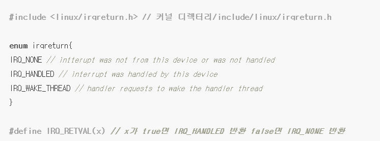

# Interrupt

## 인터럽트 관련 개념
인터럽트 핸들러 개괄
인터럽트 제어
인터럽트 활성

### 인터럽트

- (하드웨어)인터럽트 : 주변기기가 프로세서에게 어떤 사실을 알리는 일/신호

하드웨어는 프로세스 클럭과 상관없이 비동기적으로 인터럽트를 발생시킴.

인터럽트 처리 루틴

1. 하드웨어에서 물리적인 전기 신호 형태로 발생
2. 인터럽트 컨트롤러의 입력 핀으로 전달
3. 인터럽트 컨트롤러는 연결된 여러 인터럽트 배선을 하나의 배선으로 묶어 프로세스에 전달
4. 인터럽트 컨트롤러에서는 프로세서에 신호 전송
5. 프로세서는 인터럽트 처리를 위해 현재 실행하던 업무 중단
6. OS에 인터럽트가 발생했다는 사실을 알리고, OS는 상황에 맞게 인터럽트 처리

인터럽트별로 고유 값을 할당할 수 있고, 장비에 따라 다른 인터럽트를 할당할 수 있음.

e.g. 키보드에서 발생한 인터럽트 : 1번, HDD에서 발생한 인터럽트 : 2번

이 번호에 따라 OS는 적절한 핸들러를 이용해 인터럽트를 처리함

- 인터럽트 요청 라인(Interrupt ReQuest line - IRQ) : 장치들이 프로세서에게 인터럽트 신호를 보낼 수 있는 라인(=하드웨어/소프트웨어적 전송 통로/통신 시스템 통칭)
    - 이 라인에는 각기 번호가 붙음(모두 정적으로 고정 번호는 아님)
        - e.g. IRQ0은 타이머 인터럽트, IRQ1은 키보드 인터럽트, PCI버스에 연결된 장치는 동적으로 번호 할당
    - 장치별로 특정 인터럽트가 지정되어 있고, 커널이 이 정보를 들고 있음
    

### 인터럽트 핸들러

- 인터럽트 핸들러(Interrupt Handler = Interrupt service routine) : 인터럽트를 처리하기 위해 커널이 실행하는 함수

인터럽트를 발생시키는 각 장치별로 인터럽트 핸들러가 존재. 각 장치를 관리하는 커널 코드인 장치 드라이버에 담겨있음.

e.g. 시스템 타이머 인터럽트용 인터럽트 핸들러 존재

인터럽트 핸들러와 일반 커널 코드의 차이

- 핸들러 : 인터럽트가 발생했을 때 커널이 직접 호출 /  커널 코드 : 시스템 콜로 다른 프로세스가 호출
- 커널 코드 : 인터럽트 컨택스트에서 실행 / 커널 코드 : 프로세스 컨택스트에서 실행

인터럽트 컨택스트 : 커널이 인터럽트를 처리중인 상태(선점 불가능(=atomic context))

프로세스 컨택스트 : 커널 동작 상태 중 하나. 유저를 대신하여 커널이 프로세스를 실행중인 상태(선점 가능)

인터럽트 핸들러의 궁극적 목적

1. 언제라도 발생할 수 있으므로, 인터럽트 핸들러도 언제든 실행 가능하여야 함
2. 인터럽트 핸들러가 프로세서를 선점하면, 중단된 코드를 최대한 빨리 다시 복구해 실행해야 하므로, 핸들러의 실행 속도가 빨라야 함.

→ 하드웨어 입장 : OS가 지체없이 인터럽트를 처리해주어야 함

→다른 시스템 입장 : 인터럽트 핸들러의 실행 시간이 가능한 짧아야 함.

인터럽트 핸들러는 최소한 인터럽트를 받았다는 사실은 하드웨어에게 전송해주어야 함(e.g. 네트워크 프로토콜).

### 전반부 처리와 후반부 처리

- 전반부 처리(top half) : 인터럽트 핸들러가 담당하는 처리 루틴. 인터럽트를 받은 즉시 실행되고, 인터럽트 수신 확인이나 하드웨어 재설정처럼 처리 시한이 중요한 작업 위주
- 후반부 처리(bottom half) : 전반부 처리에서 실행하지 않은 나머지 모든 작업(처리 시한이 상대적으로 덜 중요).

→ 빠른 실행 속도를 보장하여야 하지만, 인터럽트 처리로 인해 발생하는 대량 작업을 실행해야 하는 두 목표는 서로 트레이드오프 관계. 이를 달성하기 위해, 빠른 실행 속도를 보장할 전반부 처리와, 대량 데이터를 처리할 후반부 처리로 나누어 임무 수행.

e.g. 네트워크 카드가 패킷을 수신한 경우

1. 인터럽트를 발생시켜 커널에 이 사실을 알림
2. 커널은 이에 반응해 네트워크 드라이버에 등록된 인터럽트 실행
3. 하드웨어에 확인 신호를 보내고, 새로 수신한 네트워크 패킷을 메모리에 복사, 네트워크 카드를 다시 패킷 수신이 가능한 상태로 조정(전반부 처리)
    
    → 네트워크 카드의 데이터 버퍼가 고정되어있으므로, 빨리 비워주지 않으면 버퍼가 모자라 수신 패킷이 버려질 수 있음.
    
4. 수신한 패킷으로 원하는 동작 처리(후반부 처리)

## 인터럽트 핸들러 개괄

### 인터럽트 핸들러 등록

드라이버 안에 인터럽트 핸들러가 등록되는데, 드라이버는 <linux/interrupt.h> 파일에 정의되어 있는 request_irq() 함수를 이용해 인터럽트를 활성화, 인터럽트 핸들러를 등록함.

int request_irq( unsinged int irq,             //할당할 인터럽트의 IRQ 번호 (1)

                    irq_handler_t handler,    //인터럽트 핸들러 함수 포인터 (2)

              unsigned long flags,       //핸들러의 동작 특성을 지정하는 플래그 (3)

              const char *name,          //인터럽트를 발생시킨 장비의 ASCII이름 (4)

              void *dev)                      //드라이버 장치 구조체 포인터 (5)

(1) : 앞서 설명한 irq 후위에 따라붙는 irq라인 번호

(2) : 인터럽트를 처리할 실제 핸들러의 함수 포인터. 인터럽트를 받을 때마다 이 함수 실행

(3) : <linux/interrupt.h>에 정의된 플래그

e.g. IRQF_DISABLED : 커널은 인터럽트 핸들러를 실행하는 동안 모든 인터럽트를 비활성화한다는 플래그 / IRQF_TIMER : 시스템 타이머를 위한 인터럽트를 처리한다는 플래그

(4) : 장비의 ASCII 형식 이름

e.g. PC의 키보드 인터럽트라면, 이 값은 keyboard로 설정. 사용자와 통신할 때 이 이름으로 사용

(5) : 인터럽트를 공유할 때 사용. 인터럽트 핸들러를 해제할 때 dev에 고유한 값(장치별로 고유한 device 구조체의 포인터 등)을 지정, 해당 IRQ 라인에서 원하는 인터럽트 핸들러만 제거 가능.

위 함수의 동작이 성공하면 0을 반환하고, 오류가 발생해서 지정한 인터럽트 핸들러 등록이 이루어지지 않으면 0이 아닌 값 반환.

### 인터럽트 핸들러 해제

드라이버를 제거하면 인터럽트 핸들러를 해제하게 되는데, 필요한 경우 IRQ 라인을 비활성화. 이 작업은 아래 함수 이용

void free_irq(unsigned int irq, void *dev) //전달인자는 위 request_irq와 이름=내용

지정한 인터럽트가

1. 공유 인터럽트가 아니라면 : 인터럽트 핸들러를 제거하고 라인 비활성화
2. 공유 인터럽트라면 : dev인자로 지정된 핸들러 제거, 모든 핸들러가 제거되면 라인 비활성화
    
    → 공유 인터럽트일 경우, 같은 인터럽트를 사용하는 여러 핸들러를 구분하기 위해서 고유한 값이 필요했던 것.
    

### 인터럽트 핸들러 작성

static irqreturn_t intr_handler(int irq, void *dev) //전달인자는 위 request_irq와 이름=내용

request_irq()함수의 handler가 사용하는 원형 그대로 선언

irqreturn_t : 인터럽트 핸들러의 반환은 IRQ_NONE, IRQ_HANDLED 두 가지 값을 사용. 본래는 간단한 int형이지만, void 반환형을 가진 2.6 이전 버전 인터럽트 핸들러에 하위 호환성 제공 가능

IRQ_NONE : 발생한 인터럽트가 해당 장치에서 생성한 것이 아닐 때 사용(요청하지 않은 인터럽트가 발생했거나, 특정 장치에서 항상 IRQ_NONE이 발생하면, 커널은 이 장비에 문제가 생겼음을 인지)

IRQ_HANDLED : 인터럽트 핸들러가 올바르게 호출되었고, 장치가 실제로 인터럽트를 생성한 경우 반환

e.g. irqreturn_t 형을 void 형으로 지정해두고, 별도 반환값을 사용함으로써 드라이버를 수정하지 않고 2.4 버전에서도 사용 가능

static 키워드 사용 이유 : 해당 소스파일에서만 사용가능하게하는 키워드인데, 인터럽트 핸들러는 다른 파일에서 사용할 일이 절대 없으므로 문법적 차원에서 이 기능을 사용하고자 static 사용

### 인터럽트 핸들러 역할

장치 및 장치가 인터럽트를 발생시킨 이유에 따라 정해짐.

인터럽트 핸들러가 제공해야하는 기본 동작

1. 발생시킨 장치에 최소한 인터럽트를 인지했다는 점은 고지
2. 인터럽트 핸들러에서 필요한 추가 작업을 처리하기 위해 장치와 데이터를 주고받는 기능 탑재
3. 추가 작업은 최대한 후반부 처리로 이관

### 공유 핸들러

공유 핸들러 : 한 인터럽트에 대해 여러 인터럽트 핸들러가 붙어있는 경우

공유 핸들러와 비공유 핸들러의 차이

- request_irq()의 flags 인자에 IRQF_SHARED 플래그 지정
- 등록한 각 핸들러의 dev 인자에 고유 값 지정(장치별 디바이스 구조체의 포인터)
- 해당 장치가 실제로 인터럽트를 발생시켰는지 판별(공유중인 다른 장비가 인터럽트를 발생시켰는지 하드웨어적 기능으로 판별 가능해야 함)

커널이 인터럽트를 받으면, 그 인터럽트에 등록된 모든 인터럽트 핸들러를 차례대로 호출. 만약, 해당 장비가 인터럽트를 발생시키지 않았다면 핸들러를 바로 종료

→ 하드웨어에 핸들러가 확인할 수 있는 상태 레지스터같은 방식이 필수. 대부분 하드웨어는 제공.

## 인터럽트 제어

### 인터럽트 컨택스트

인터럽트 컨택스트 : 커널이 인터럽트를 처리중인 상태(선점 불가능(=atomic context))

따라서, 함수가 실행중에 자기를 실행시킨 프로세스를 휴면 상태로 전이시킬 수 있다면, 인터럽트 핸들러에서 그 함수를 사용할 수 없음.

인터럽트 핸들러는 다른 코드를 중단시킴

이런 비동기적 속성은 모든 인터럽트 핸들러가 가능한 빠르고 간단해야 함(복구해줘야하므로)

인터럽트 핸들러에서 가능한 최대한 빨리 많은 작업을 후반부로 치워야 함

과거 인터럽트 핸들러는 자체 스택이 없었고, 핸들러가 중단시킨 프로세스 스택을 공유.

현재 인터럽트 핸들러는 커널 스택을 공유, 데이터를 저장할 때 최소한으로 사용.

2.6개발 초기에 이 공유중인 커널 스택 사이즈를 작게 했으나(할당하는 페이지 크기 자체를 줄이는 방법으로), 프로세서마다 인터럽트 스택을 추가해줌.

인터럽트 스택(Interrupt stack) : 프로세서마다 하나씩 한 페이지짜리 인터럽트 핸들러를 위해 추가한 스택

e.g. 키보드 입력 인터럽트 발생. 

1. 전기적 신호 생성
2. 인터럽트 컨트롤러를 통해 프로세서에 전달
3. 프로세서는 하던 일 중단, 인터럽트 시스템 비활성화, 키보드 인터럽트 핸들러가 존재하는 메모리 주소에 바로 액세스해 인터럽트 핸들러 실행(드라이버 구조체에 표기?)
4. IRQ번호와 중단시킨 작업의 PCB를 스택에 저장하고, 커널이 do_IRQ() 함수 호출
5. 인터럽트 라인에 유효한 핸들러가 있는지 판별
    
    있으면 핸들러 실행, 없으면 ret_from_intr() 함수 호출
    
    - ret_from_intr()함수 : 대기중인 스케줄링 작업이 있는지 판별하는 어셈블리어 함수(need_resched 변수가 설정되어 있는지 확인하는 작업)
        - need_resched 변수 : kernel/sched.c에 정의. 스케줄러가 이 플래그변수를 set 한다면 process switching 가능
    
    set 되어있다면 중단했던 커널 코드로 다시 복귀
    

### 인터럽트 상태 조정

리눅스 커널에서는 시스템의 인터럽트 상태를 조정하는 인터페이스 있음(<asm/system.h>, <asm/irq.h>에 적재)

현재 프로세서의 인터럽트 시스템을 비활성화하거나, 전체 시스템의 특정 인터럽트 비활성화 가능

→ 이유 : 동기화를 제공하기 위해 시스템을 진정시키는 용도

- 인터럽트를 비활성화시키면 인터럽트 핸들러가 선점되지 않는다고 보장할 수 있음

리눅스는 다중 프로세서를 지원하므로, 일반적 커널 코드에 다른 프로세서가 공유 데이터에 동시에 접근하는 경우를 막을 잠금 장치가 필요함.

→ 잠금을 통해 다른 프로세서의 동시 접근을 막을 수 있고, 인터럽트를 비활성화시켜 인터럽트 핸들러의 동시 접근도 막을 수 있음

## 인터럽트 활성화 / 비활성화

### 프로세서에 대해서만 활성화 / 비활성화

인터럽트를 현재 프로세서에 대해서만 비활성화하고 활성화 할때는 아래처럼 사용

local_irq_disable(); //cli 어셈블리 명령으로 구현

// 인터럽트가 비활성화된 상태

local_irq_enable(); //sti 어셈블리 명령으로 구현

cli : 인터럽트 허용 플래그(allow interrupts flag)를 해제

sti : 인터럽트 허용 플래그를 설정

→ 해당 프로세서에 인터럽트 전달 여부를 설정하는 플래그

### 특정 인터럽트만 활성화 / 비활성화

인터럽트 마스킹(Interrupt masking) : 전체 시스템의 특정 인터럽트만을 비활성화시키는 경우

e.g. 장치의 상태를 조정할 경우, 장치의 인터럽트를 비활성화시키고 진행하고싶을 수 있음

리눅스가 제공하는 인터페이스는 아래 4가지

위 2개 함수는 인터럽트 컨트롤러의 해당 인터럽트를 비활성화(시스템의 모든 프로세스에 해당 인터럽트가 전달되지 않게끔 비활성화)

enable_irq 함수는 인터럽트를 다시 활성화해주는 함수

synchronize_irq 함수는 실행중인 인터럽트 핸들러가 있다면, 핸들러가 종료된 다음 비활성화

## 인터럽트 시스템 상태

인터럽트 시스템의 활성화 여부나 현재 인터럽트 컨택스트에 있는지 확인해야 하는 경우

<asm/system.h> 파일에 있는 irqs_disabled() 매크로는 현재 프로세스의 인터럽트 시스템이 비활성화되어 있다면 0이 아닌 값을 반환. 활성화되어있으면 0을 반환.

<linux/hardirq.h>에 있는 매크로 중, in_interrupt() 매크로는 커널이 인터럽트를 처리하고 있는 경우라면 0이 아닌 값으 ㄹ반환. 

## Github 인터럽트 질문

### Interrupt vs Polling

Interrupt : CPU는 발생한 인터럽트를 직접 기다리지 않고 인터럽트가 발생했다는 알람이 생겼을 경우에만 인터럽트 핸들러 처리를 수행(=blocking 방식)

Polling : CPU가 다른 프로세스를 수행하지 않고(혹은 주기적인 이벤트 신호를 통해) 인터럽트의 발생 여부를 busy-wait로 대기하는 방식

busy wait : 처리 유닛이 주기적으로 루프를 돌며 이벤트가 발생했는지 대기 및 확인하는 방식

### HW Interrupt / SW Interrupt

공통점 : 발생했을 경우, CPU는 IVT를 통해 ISR의 위치를 참조해 Program Counter에 실행 루틴 적재 및 실행

차이점 : 

인터럽트를 발생시키는 주체가 HW의 경우 보통 주변장치, SW의 경우 프로세스가 인터럽트를 발생시킴

이때, 사용자가 의도적으로 발생시킨 인터럽트는 SW 인터럽트, 의도적이지 않은 발생 등 예외같은 경우는 트랩(Trap)이라고 부름

### 여러 인터럽트가 동시에 발생했을 경우

우선순위를 두어 더 긴급한 인터럽트부터 처리.

1. 우선순위가 더 높은 ISR에 대해 네스팅 방식으로 동작. 인터럽트를 발생시키는 두 프로세스에 대해 우선순위에 따라 Context Switching 수행
    
    네스팅(Nesting) : 한 루틴 안에 동일한 루틴이 다시 동작하도록 구성된 방식.
    
2. 우선순위가 더 낮은 인터럽트에 대해 마스킹처리를 하고, 우선순위가 더 높은 인터럽트를 처리한 후에 마스킹을 해제하고 마저 처리