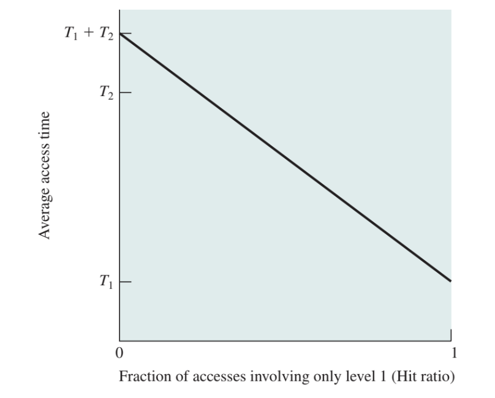

# Memory Hierarchy

## 메모리 계층

### 정의

CPU와 메모리 사이에서 데이터 교환 중 발생하는 오버헤드를 최소화하고, 효율적인 운용을 위해 데이터 저장 계층을 수직적으로 구조화한 방식

CPU와 가까울수록 빠르지만, 그만큼 하드웨어적으로 cost가 비싸짐(속도와 비용이 반비례)

메모리 계층구조에서 cost : 시간적 비용 & 공간적 비용으로 나눌 수 있음

시간적 비용(Time Cost, Latency) : 메모리에 접근하는 데 걸리는 시간.

cpu register, L1~L3 cache는 access에 수 ns 단위로 소요

RAM은 약 50~100ns, SSD나 HDD는 단위가 달라질 만큼 소요

공간적 비용(Cost per bit) : 해당 메모리를 실제 하드웨어로 구현하는 데 드는 단가

### 의의

하드웨어 아키텍처를 설계할 때 아래와 같이 설계할 경우, 평균 Access time은 위 그림처럼 나타낼 수 있음

L1에는 1,000byte만큼 저장하고, Access time을 0.1μs 로 가정. 이 메모리에 접근하는 데 필요한 시간은 T1이라 명명

L2에는 100,000byte만큼 저장하고, Access time을 1μs로 가정. 이 메모리에 접근하는 데 필요한 시간은 T2라 명명

만약 L2에 있는 데이터가 필요할 경우, 이를 L1 계층으로 끌어올려서 액세스하도록 만들었다고 가정.

어떤 데이터를 끌고오는가? 에 대한 연산 시간은 모두 무시한다고 가정.

초기 메모리 내부엔 아무 데이터도 없으므로 Storage에서 메모리로 로드해오는 시간이 필요하기 때문에 Upper bound가 T1 + T2라고 설정.

연산이 길어질수록 자주 사용하는 데이터를 L1 계층으로 로드해오고, 이때 Hit ratio가 높아지므로 점차 전체 데이터에 대한 Access time이 T1으로 수렴함.

위 내용에서, 만약 Hit Ratio가 95%라고 가정한다면, 실제 소요시간을 아래와 같이 계산할 수 있음

### 구조

- Inboard memory : 메인보드 안에 탑재되어있는 메모리
    - Register : CPU 내부에 위치한 데이터저장소
        - 현재 실행중인 연산에 필요한 데이터 혹은 주소, 결과 등을 임시로 저장하는 위치
        - 모든 저장소 중 가장 빠르고, 용량이 Byte 단위로 매우 작음
    - Cache : CPU와 Main memory 사이에 위치한 임시 저장소
        - 자주 사용되는 데이터나 명령어를 저장해서 cpu에 빠르게 액세스할 수 있도록 지원하는 중간 계층
        - 주로 MB 단위.
        - 현대 HW Architecture 에서는 Cache도 Hit ratio에 따라 3개 Level로 나눠서 두는 경우가 일반적(L1 ~ L3)
        
        
        
        
        
        - 현재 머신의 특성 등, 여러 환경적 요인에 의해 어떤 데이터를 Cache해둘 것이냐에 대한 논의가 필히 이루어져야 함(아래 부록 Caching Idea 부분 참고)
- Outboard Storage : 메인보드 바깥에서 Attach되어 데이터를 저장하는 보조기억장치 Layer
    - Magnetic Disk(= HDD), etc. : 전기적 방법으로 데이터를 저장하고, 이를 추후 어떤 머신에서도 attach해서 사용할 수 있는 저장장치들 모음.
        - 용량이 매우 크지만 시간상으로 많이 느려 당장 연산에 필요하지 않는 데이터들을 넣어두는 곳
- Offline Storage : 위와 비슷하지만, 전기적 성질을 지니지 않고도 데이터를 저장할 수 있는 매체

## 메모리 계층이 성능 향상을 얻을 수 있는 근거

### 메모리 근접성(Principle of Locality)

정의 : 한번 사용된 메모리는 시간적, 혹은 공간적으로 인접한 경우 다시 사용될 가능성이 매우 높다는 원칙

크게 시간 근접성, 공간 근접성으로 분류 가능

시간 근접성(Temporal Locality) : 한번 접근한 데이터는 짧은 시간 내 다시 접근될 가능성이 높다는 원리. 이를 기반으로 가장 최근에 사용된 데이터를 캐시 메모리에 업로드

공간 근접성(Spatial Locality) : 메모리의 특정 위치에 접근했다면, 그 주변 위치의 데이터도 접근할 가능성이 높다는 원리. 이를 기반으로 최근 사용된 데이터의 주변 데이터도 같이 캐시 메모리에 업로드

## Cache Memory Architecutre

위 구조상에선, 한 메모리 블록은 단 하나의 캐시 라인에만 들어갈 수 있으므로, Tag에 현재 어떤 블록이 들어와있는지를 명시함. 만약 액세스하고자 하는 데이터가 현재 Cache Tag에 등록되어 있는 블록 안에 있다면 Cache hit, 없다면 Cache miss가 발생한 것.

→ 만약 캐시가 가득 찼는데 cache miss가 발생했다면?

⇒ 캐시에 들어있는 최소 1개 이상의 데이터는 최근에 사용되지 않았으므로, 방금 액세스를 요청한 데이터보다 중요도가 상대적으로 떨어진다는 의미. 이때 캐시 일부를 교체해주는 작업이 필요(=Cache Replacement)

- 캐시 미스의 종류 3가지(3C)
    1. Compulsory(=Cold) : CPU에서 처음으로 사용하는 블록이라 발생하는 미스
        
        e.g., for loop에서 가장 처음에 시작하는 연산에서 발생
        
    2. Capacity : 캐시 용량이 작아서 발생한 미스
        
        e.g., 액세스하고자 하는 데이터 용량 자체가 캐시 용량을 넘어서서, 초기 캐싱해둔 용량 너머의 데이터에 액세스하는 경우 발생
        
    3. Conflict : 매핑 충돌로 인해 발생하는 미스
        
        e.g., 위 그림 예시처럼, cache 자체의 용량이 상대적으로 작고 블록이 훨씬 더 많을 경우, 해시 충돌처럼 불운하게 다른 요청이어도 액세스하고자 하는 블록의 tag가 겹칠 수 있음
        
        만약, 메모리 블록 번호가 1, 2, 3, 4, 5이고, 캐시 메모리에 적재 가능한 블록의 크기가 4라면, 블록 1과 5는 모두 mod 4 연산에서 1을 반환하므로 캐시 미스 확률이 높음
        
- 캐시 교환 정책(Cache Replacement Politics)
    1. Direct(방금 액세스에 실패해 충돌이 발생한 그 위치를 교환)
    2. LRU(Least Recently Used) : 가장 안쓰인 캐시 라인을 제거
    3. FIFO : 가장 먼저 캐시에 들어왔던 캐시 라인을 제거
    4. Random : 무작위로 라인 하나를 선정해서 제거

### Cache Memory Mapping

main memory에서 캐시의 어느 위치에 저장할지 결정하는 방법. 캐시에 어떻게 주소를 결정하느냐에 따라 3가지 방법으로 분류됨

1. Direct Mapping(직접 매핑)
    - main memory의 특정 블록이 캐시 메모리의 “단 한 곳”에만 위치할 수 있음
    - cache memory 안에 들어가는 주소는 세 부분으로 나뉘어 저장
        1. Index : 캐시 메모리의 어느 위치에 저장될지 결정
        2. Tag : 해당 캐시 라인에 저장된 데이터가 주 메모리의 어느 블록에서 왔는지 명시
        3. Offset : 블록 내에서 찾고자 하는 데이터가 어디 있는지 명시
    - 가장 단순하고 구현이 쉬우며 속도가 빠르지만, 서로 다른 두 메모리 블록이 한 캐시 위치에 매핑될 경우, conflict miss가 발생할 수 있음
2. Fully Associative Mapping(완전 연관 매핑)
    - main memory의 블록이 캐시의 어떤 부분에도 모두 저장될 수 있음
    - 아무데나 저장될 수 있으므로, index 부분이 필요없는 2가지(tag, offset) 정보만 담음
    - 교체 충돌이 발생하지 않고 캐시 적중률이 가장 높지만, 캐시에 저장된 모든 태그를 전부 비교해서 찾아야 하므로, 비용이 많이 듦
3. Set-Associative Mapping(집합 연관 매핑)
    - 위 2가지 방식을 결합한 절충안 성격의 매핑 방법.
    - 캐시 메모리를 여러 단위의 집합(set)으로 분류하고, 각 집합에는 여러 캐시 라인이 포함됨
    - 주 메모리 블록에는 정해진 집합에만 들어갈 수 있지만(Direct Mapping), 집합 안에서는 빈공간 아무데나 들어갈 수 있음(Fully Associative Mapping)
    - 내용은 Index, Tag, Offset으로 구성됨(내용은 Direct Mapping에서 설명한 바와 같음)
    - Direct Mapping보다는 구현이 다소 복잡하지만, Fully Associative Mapping보다는 간단해서 현대 cs에서 가장 널리 사용되는 방식

## Cache Write Policy

정의 및 목적 : 캐시는 메모리에 있는 데이터를 복사해와서 임시로 저장 및 사용하는 저장소. 따라서 캐시 내에서 데이터가 변경되는 경우, 메모리에 있던 원본 데이터와 일관성을 보장해야 함.

방법 : 크게 3가지로 구분

1. Write Through
    - CPU가 Cache에 쓰기 작업을 수행하면, 메인 메모리에도 바로 반영
    - 항상 캐시와 메인 메모리의 데이터가 일치하므로 일관성이 보장됨
    - 구현이 단순하지만, 쓰기 빈도가 많으면 메모리 대역폭을 낭비해 throughput이 하락
        - 이를 해소하고자 Write buffer를 두어 버퍼가 idle time에 천천히 메모리에 반영하는 방법도 등장함
2. Write Back
    - CPU가 캐시에만 쓰기 작업을 수행하고, 메모리는 나중에 갱신하는 방법
        - 캐싱된 블록에 쓰기 작업을 수행할 때, Dirty bit에 TRUE값으로 set해서 변경됨을 알림
            - Dirty bit : 현재 캐시가 쓰기작업으로 인해 기존 메모리와 값이 다르다는 것을 알리는 flag bit
    - 캐시 블록이 교체될 때, Dirty bit의 set 여부를 판별해서 TRUE라면 그때 메모리에 반영
    - 메모리에 대한 쓰기 횟수가 현격하게 줄어들어 성능이 오르지만, 캐시와 메모리 내 데이터가 다른 시간이 필연적으로 발생하므로, 멀티코어 혹은 다중캐싱 환경에서 일관성이 보장되지 않음
3. Write Allocate, No Write Allocate
    - 두 경우 모두 캐시 내부 데이터에 쓰기 작업을 수행했을 때, miss가 발생한 경우 사용하는 방법
    - Write Allocate(=fetch-on-write) 방식은 미스가 나면 해당 블록을 캐시에 통째로 가져와서 쓰기 작업을 수행
        - 보통 write-back 방식과 혼용해서, 자주 사용할 블록을 미리 캐싱해둠
    - No Write Allocate 방식은 미스가 나면 메모리에만 직접 쓰고 캐시는 갱신하지 않음
        - 캐시 오염을 방지하기 위해 Write-Through 방식과 혼용해서 사용
            - 캐시 오염(cache pollution) : 재사용 가능성이 낮은 데이터가 단 1회 사용을 목적으로 재사용 가능성이 높은 데이터를 밀어내는 현상

## 캐시 일관성 프로토콜

정의 및 목적 : 멀티코어 아키텍처에서, 여러 코어가 동일한 메모리의 데이터에 대한 캐시를 각각의 core dependant cache에 복사 저장해서 연산을 수행중일 수 있음. 이때 한 코어가 기존 메모리의 원본 데이터를 수정하면, 다른 코어들은 stale data를 보고 있는 문제가 생김. 이를 해결하고자, 모든 캐시의 데이터가 일관되도록 지원하는 프로토콜

core dependant cache(실제 있는 말인진 모름. 설명 편의를 위해 만든 말) : L1, L2 캐시와 같이 코어 단위로 종속되어있는 캐시

stale data : 값이 업데이트되지않은 오래된 정보

대전제 : 어떤 시점에서도 한 주소에 대해 여러 참조자는 가능하지만, 수정 권한은 한 코어만 가져야 하고, 같은 주소에 대한 쓰기 작업은 모든 코어에 관찰되어야 함

(=Single Writer / Multiple Reader)

요구사항 : 

→ “어떤 시점에서도 일관성이 보장되어야 함” : “트랜잭션 직렬화” 필요

→ “같은 주소에 대한 쓰기작업은 모든 코어에 관찰되어야 함” : “쓰기 전파” 필요

일반적인 구현 메커니즘 : 

- 버스 스누핑(Snooping, Broadcast)
    - 모든 캐시는 버스를 관찰하는 스누퍼(Snooper)를 배치하고, 이 스누퍼는 버스에서 이루어지는 모든 트랜잭션을 모니터링
    - 만약 공유 캐시 블록을 수정하는 트랜잭션이 나타날 경우, 모든 스누퍼는 자신이 가지고 있는 캐시에 수정하고자 하는 블록과 동일한 복사본이 있는지 확인
    - 만약 캐시에 복사본이 있다면 이를 수정하거나 flush하고 다시 작성
        - 수정하는 방법 : Write-update 방법. 쓰기 작업을 수행하는 프로세서가 읽기 작업을 수행하는 다른 프로세서에게 update 라고 push. 만약 다른 프로세서들이 이 값을 캐시에 들고 있다면, 그 값을 새로 update된 값으로 갱신
            - broadcast는 이런 과정에서 발생하는데, 데이터 트래픽이 너무 커서 최근 CPU에서는 보기 드문 방식
        - flush하고 다시 작성하는 방법 : Write-Invalidate 방법. 쓰기 작업을 수행하는 프로세서가 다른 프로세서 소속의 복사본 캐시를 전부 무효화하고, 자신만이 유일한 Writer로 군림함.
            - 캐시 라인에서 status flag를 통해 그 캐시에 대한 해당 프로세서의 권한을 명시
            - 구현 방식에 따라 MSI, MESI, MOSI, MOESI, MESIF 등 다양한 프로토콜이 존재함
- 디렉터리 기반(Directory-based)
    - 실제 원본 데이터가 저장되어있는 메모리 주소 바로 옆에, 이 데이터에 대해 캐싱하고있는 프로세서는 누구인지를 명시해두는 메타데이터를 저장.
    - 기존 bus snooping 방식의 경우, 시스템 규모가 커지고 프로세서가 많아질수록 대역폭 사용량이 현격하게 증가해 확장성이 극히 낮아짐
    - 이를 해결하고자, 실제 이 데이터를 직접 캐싱하고있는 프로세서들의 목록을 마련해두고, 원본 데이터에 수정이 필요하면 이 메타데이터를 보고 필요한 프로세서들에게만 알려주는 방식으로 구현
    - 쓰기 작업을 수행하는 프로세서는, 이 메타데이터를 관리하는 Memory Controller, 혹은 Coherence Controller에게 전파를 요청하는 방식으로 동작

## Github 질문 목록

- 캐시 메모리는 어디에 위치해 있나요?
    
    → 캐시 레벨에 따라 다르지만, 통상 CPU 코어 내부, 혹은 바로 옆에 붙어있음
    
    → L1, L2 : 코어 바로 옆에 붙어서 멀티코어 아키텍처에서도 각 코어단위로 할당
    
    → L3 : 코어들 사이에 공유되는 레벨이므로, 멀티코어 아키텍처에서 코어들 사이에(=옆에) 존재
    
- L1, L2 캐시에 대해 설명해 주세요.
    
    → L1 : 가장 작고 빠른 캐시. 보통 자주 사용하는 명령과 데이터를 분리해서 저장하고, max 수십 kb수준. 소요시간은 0~1ns단위
    
    → L2 : L1보다 조금 크고 느린 캐시. 수백 kb에서 수 mb수준
    
- 캐시에 올라오는 데이터는 어떻게 관리되나요?
    
    → 블록 단위로 저장(2^n bit 크기로 이루어진 메모리 단위). 내부에 Tag, Valid, Dirty 메타데이터를 가지고 있음
    
    → 교체 정책과 쓰기 정책에 의거해 수명과 동기화를 관리함
    
- 캐시간의 동기화는 어떻게 이루어지나요?
    
    → 쓰기 정책과 캐시 일관성 프로토콜에 의해 유지됨. 캐시에 누군가 쓰기 작업을 요청하면, 버스를 스누핑해서 각자 캐시를 업데이트하거나, 디렉토리 기반 방식을 통해 조정자가 필요한 프로세서에게 알려주는 방식으로 일관성을 보장함
    
- 캐시 메모리의 Mapping 방식에 대해 설명해 주세요.
    
    → 크게 3가지 방식
    
    ⇒ Direct Mapping : 메모리 블록이 캐시의 정해진 위치에만 들어가는 방식. conflict miss가 자주 발생하지만, 가장 구현이 쉬움
    
    ⇒ Fully Associative Mapping : 메모리 블록이 캐시 아무데나 들어갈 수 있는 방식. cache hit ratio가 가장 높지만, 캐시를 전부 탐색해야 하고 구현이 복잡함
    
    ⇒ Set Associative Mapping : 위 두 방식을 결합한 방법. 메모리 블록은 캐시 메모리의 정해진 집합에만 들어갈 수 있지만, 집합 안에서는 아무데나 들어갈 수 있음. 현대 가장 널리 사용되는 방식
    
- 캐시의 지역성에 대해 설명해 주세요.
    
    → 한번 사용된 데이터는 시간상으로 다시 사용될 가능성이 높고, 공간상으로 인접한 데이터들도 함께 사용될 가능성이 높다는 원리. 메모리를 캐싱해서 사용할 때 속도가 향상되는 원리
    
- 캐시의 지역성을 기반으로, 이차원 배열을 가로/세로로 탐색했을 때의 성능 차이에 대해 설명해 주세요.
    
    → C/C++에서는 2차원 배열은 가로(행 단위)로 배치됨
    
    e.g., int arr[10][3]이 있다면,
    
    arr[0][0] , arr[0][1], arr[0][2], arr[1][0], arr[1][1], arr[1][2], … , arr[9][2]
    
    이를 일반화해서 수식을 작성한다면
    
    $$
    addr(i, j) = base + (i*M + j) * sizeof(elem)
    $$
    
    프로세서가 위와 같은 배열에 접근할 때, 캐시는 공간 지역성(Spatial Locality)에 의해 인접한 데이터를 한데 묶어 캐시 라인에 저장함
    
    가로로 탐색했을 경우, 원래 배열 자체가 가로 단위로 저장되기 때문에 공간 지역성의 효과를 볼 수 있어 Cache hit를 노릴 수 있음
    
    세로로 탐색했을 경우, 가로 행 개수만큼 떨어져있는 데이터를 탐색하고자 하므로 공간 지역성이 떨어져 Cache hit ratio가 떨어짐
    
    → 되도록 캐시 히트율을 올리기 위해, 안쪽 루프를 마지막 차원에 배치하는 것이 시간 성능 면에서 유리함
    
- 캐시의 공간 지역성은 어떻게 구현될 수 있을까요? (힌트: 캐시는 어떤 단위로 저장되고 관리될까요?)
    
    → 공간 지역성은 Cache line 단위로 구현됨.
    
    프로세서가 메모리에서 데이터를 읽을 때, 캐시는 해당 데이터 자체 뿐 아니라 그 주변 인접 데이터들도 함께 가져옴. 이때 캐시 라인 단위로 가져오며, 크기는 32byte or 64byte로 고정됨
    
    공간 지역성을 이용해 구현하려면, array와 같이 연속된 데이터 구조를 사용하는 것이 가장 대표적
    
    → 선형으로 구성된 컨테이너를 사용할 경우, 인접 데이터들이 캐시 라인에 들어올 확률이 높으므로 공간 지역성을 구현할 수 있음
    
    → 함께 사용되는 변수들을 한 구조체에 모아 저장하면, 캐시 라인에 함께 들어갈 확률이 높아짐
    

# 부록

## Caching Idea

→ 분산 오브젝트 스토리지 서비스에서 어떤 데이터를 caching할 것인지 결정하는 방법론에 대한 고민. 이는 곧 제공하는 서비스, 구성하는 시스템이 어떤 방식이냐에 따라 캐싱 정책이 달라져야 한다는 것을 시사함.

→ 위 시스템은 분산 오브젝트 스토리지 서버인데, 어떤 서버가 어떤 캐시를 가지고 있고, 여러 서버에 그 캐시를 어떻게 공유할 것인지에 대한 정책을 계산하는 페이지.

→ 이 경우, 한 캐시가 Cache cold 상태가 되어 Hit ratio가 적어지면 flush 해주는 과정이 필요한데, 이 과정을 모델링하기 위한 과정 중 일부.

→ Zipfian Distribution을 기반으로, “인기”가 많은 특정 데이터는 상대적으로 얼마만큼의 인기를 지녔는지, 어느정도의 인기를 가진 데이터를 캐싱할 것인지에 대한 논의가 이루어지는 내용.

(결론 : 사용량 상위 0.6%에 이르는 데이터만 캐싱해둬도 웬만한 요청의 80%는 캐시 데이터 이내에서 커버 가능함)

위와 같은 분석을 거치면, 아래 Architecture 에서 어떤 object가 이를 서비스해줄 것인지를 결정하면서 시스템을 설계함

필요하다면 Cache 계층 자체를 여러 수준으로 나누어서 구현할 수도 있음

e.g.1)

위 시스템에서 캐싱 레벨을 나누어본다면?

1. 클라이언트가 시스템에 파일을 요청할 경우, File System Level에서 1차 캐싱

1. File System 내부에 실제로 들어가있는 각 저장소 내부에서 2차 캐싱

e.g. 2)

집, 회사 등에서 NAS(Network Attached Storage)를 구축할 경우, 안에 NAS 전용 RAM, 혹은 SSD를 탑재해서 캐싱 계층을 추가하거나 캐싱 용량 자체를 늘릴 수 있음

# 참고 출처

[[다나와] Synology DS720+ RAM 2GB (하드미포함)](https://prod.danawa.com/info/?pcode=11597960)

[Architecture Guide | Red Hat Ceph Storage | 3 | Red Hat Documentation](https://docs.redhat.com/en/documentation/red_hat_ceph_storage/3/html-single/architecture_guide/index)

[repository.dinus.ac.id](https://repository.dinus.ac.id/docs/ajar/Operating_System.pdf)

[Cache Tiering — Ceph Documentation](https://docs.ceph.com/en/latest/rados/operations/cache-tiering/?utm_source=chatgpt.com)

[리눅스 구조 (메모리 계층)](https://velog.io/@jjmoon4682/%EB%A6%AC%EB%88%85%EC%8A%A4-%EA%B5%AC%EC%A1%B0-%EB%A9%94%EB%AA%A8%EB%A6%AC-%EA%B3%84%EC%B8%B5)

[Directory-based cache coherence](https://en.wikipedia.org/wiki/Directory-based_cache_coherence)

[버스 스누핑](https://ko.wikipedia.org/wiki/%EB%B2%84%EC%8A%A4_%EC%8A%A4%EB%88%84%ED%95%91)

[캐시 일관성](https://ko.wikipedia.org/wiki/%EC%BA%90%EC%8B%9C_%EC%9D%BC%EA%B4%80%EC%84%B1)

[Basics of Cache Memory – Computer Architecture](https://www.cs.umd.edu/~meesh/411/CA-online/chapter/basics-of-cache-memory/index.html)

[지프의 법칙](https://ko.wikipedia.org/wiki/%EC%A7%80%ED%94%84%EC%9D%98_%EB%B2%95%EC%B9%99)

---

## 발표자료

[CS study D9. Memory Hierarchy.pdf](CS_study_D9._Memory_Hierarchy.pdf)