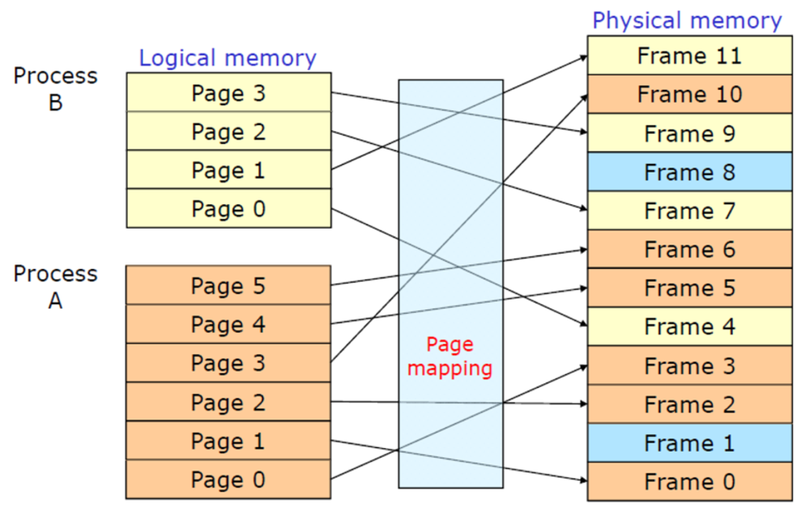

# Memory Management

### 페이지

커널은 물리적 페이지를 메모리 관리의 기본 단위로 사용

프로세서의 메모리 접근 최소 단위는 바이트나 워드지만, 메모리 관리 장치(Memory Management Unit : CPU가 메모리에 접근하는 것을 관리하는 컴퓨터 하드웨어 부품.)는 페이지 단위로 처리.

MMU는 페이지 크기의 정밀도를 가진 시스템 페이지 테이블을 관리.

→ 가상 메모리 관점에서는 페이지가 유의미한 최소 단위 라는의미

32비트 아키텍처는 4KB, 64비트는 8KB가 기본값이지만, 아키텍처에 따라 다름.

커널은 struct page 구조체를 사용해 모든 물리적 페이지 표현.

struct page {

unsigned long flags;                      //페이지 상태 저장

atomic_t count;                              //참조 횟수 저장

atomic_t mapcount;

unsigned long private;

struct address_space *mapping;

pgoff_t index;

struct list_head lru;

void *virtual;                                  //페이지 가상 주소 저장

...

}

- page 구조체는 가상 페이지가 아닌 물리적 페이지를 나타냄.
    - 구조체가 기술하는 내용은 일시적인 내용일 가능성이 높음
        - 페이지에 들어있는 데이터가 오래 남는다고 해도, 스왑 등 페이지 정보가 변경될 경우, 그 데이터가 항상 같은 page구조체 안에 있을거라는 보장 없음.
    - 커널이 물리적 페이지를 나타낼 때 이 구조체를 사용함
    - 물리적인 메모리를 표현하기 위함이지, 그 안의 데이터를 표현하고자 하는 자료구조는 아님
- 커널은 페이지가 미사용 상태인지 알아야 하므로(없으면 스와핑으로 HDD로 보내는 연산 등을 수행하기 때문), 이 구조체를 사용해 시스템의 모든 페이지를 관리.
- 페이지가 사용중이라면 커널은 누가 사용중인지 정보 필요
    - 페이지 소유자 : 사용자 공간 프로세스, 커널 데이터, 정적 커널 코드 페이지 캐시 등

### 구역

하드웨어적 한계로 커널은 모든 페이지를 동일하게 취급할 수 없음

e.g. 메모리 최대 용량 이상으로 메모리에 데이터를 적재해둘 수 없으므로, 참조 횟수가 없는 페이지는 HDD로 보내는 등 처리가 필요

이를 위해 커널은 페이지를 여러 구역으로 분할.

커널은 구역을 이용해 비슷한 특성을 가진 페이지를 그룹화

→ 메모리 지역성을 얻을 수 있음(아래 그림 참조)

리눅스는 필요할 때 할당 가능하도록 시스템 페이지를 구역별로 나누어 관리

리눅스에서는 크게 4가지 주요 메모리 구역으로 분류

- ZONE_DMA : DMA(Direct Memory Access : 특정 하드웨어 하위 시스템이 CPU와 독립적으로 메인 시스템 메모리에 접근할 수 있게 해주는 기능) 수행 가능 페이지 그룹
- ZONE_DMA32 : DMA 수행 가능 페이지 그룹이지만, 32비트 장치들만 접근 가능
- ZONE_NORMAL : 통상적으로 할당되는 페이지 그룹
- ZONE_HIGHMEN : 커널 주소에 상주하지 않는 페이지(상위 메모리(후위 설명)) 그룹

e.g. DMA를 위한 메모리가 필요하면 ZONE_DMA 구역에서 필요한 페이지 할당.

- 구역은 커널이 논리적으로 구분한 단위고, 실제 메모리와 물리적인 연관성은 없음

대부분은 여러 구역에서 페이지 할당 가능. 하지만, 두 구역 모두에서 할당받을 순 없음.

### 페이지 할당

커널은 메모리 획득을 위해 저수준 방법과 할당받은 메모리에 접근하는 몇 가지 인터페이스를 제공

모두 페이지 크기 단위로 할당을 진행해주고, 인터페이스는 <linux/gfp.h>에 정의

핵심 페이지 할당 함수는 아래와 같음

struct page * alloc_pages(gfp_t gfp_mask, unsigned int order)

→함수 실행 결과, 2^order만큼 연속된 물리적 페이지를 할당해주고, 첫 번째 페이지의 page 구조체 포인터를 반환, 오류 발생시 NULL 반환(gfp 관련 정보는 후위에 설명).

특정 페이지의 논리적 주소를 얻을 수 있는 함수

void * page_address(struct page *page)

→지정한 물리적 페이지에 현재 담겨있는 논리적 주소 포인터 반환

페이지 내용이 0으로 초기화된 페이지를 할당하는 함수

unsigned long get_zeroed_page(unsigned int gfp_mask)

→ 하단 표에 표기된 __get_free_page() 함수와 동일하지만, 모든 페이지의 내용이 0으로 초기화

(e.g. 의도치 않게 할당된 페이지 안에 미처 지우지 못한 데이터가 들어간 경우)

⇒ 사용자 공간으로 반환하는 페이지의 모든 데이터를 0으로 초기화하거나, 그에 준하는 정리작업 필요 

### 페이지 반환

 페이지가 더 이상 필요하지 않으면, 할당된 페이지를 반환.

반환시에는 반드시 할당받은 페이지만 반환(만약, struct_page 구조체를 잘못 지정하거나, order값을 잘못 지정하면 메모리 침범이 발생할 수 있음).

### kmalloc()

flags 인자가 추가되었다는 걸 빼면 malloc()와 같음.

kmalloc() : 커널 메모리를 바이트 단위로 할당할 때 사용되는 인터페이스. <linux/slab.h> 에 정의

void * kmalloc(size_t size, gfp_t flags)

→ size 바이트 길이를 가진 메모리 영역의 포인터를 반환. 할당된 메모리 영역은 물리적으로 연속된 영역. 오류 발생시 NULL 반환.

### gfp_mask 플래그

<linux/types.h> 파일에 unsigned int 형으로 정의된 gfp_t 타입 사용.

- gfp? : __get_free_pages() 의미(=get_free_pages() 콜할 때 리턴되는 페이지는 어떤 속성을 가지고있느냐?).

이 플래그는 동작 지정자, 구역 지정자, 형식 의 3가지로 분류 가능.

- 동작 지정자 : 요청한 메모리를 컨러이 어떻게 할당할것인지를 지정
    - e.g. 인터럽트 핸들러는(재스케줄링이 불가하므로) 커널에게 메모리 할당 작업중 휴면 상태로 전환하지 말라고 알림.
- 구역 지정자 : 어느 곳의 메모리를 할당할것인지 지정
- 형식 : 특정 메모리 할당 형식에 필요한 동작 지정자와 구역 지정자의 조합

→ 하나씩 면밀하게 살펴보면 아래와 같음

동작 지정자

 

아래처럼 조합해서 사용 가능

e.g. ptr = kmalloc(size, __GFP_WAIT | __GFP_IO | __GFP_FS);

→ 작업 중단 가능, 필요시 입출력이나 파일시스템 사용 가능하다는 것을 페이지 할당자에게 안내.

⇒ 이 플래그들로 커널은 할당할 메모리를 찾는 방법을 선택 가능.

구역 지정자

메모리를 어느 구역에서 할당할 것인지 지정. 보통 커널은 다른 구역의 미사용 페이지가 필요할 경우를 대비해서 ZONE_NORMAL 우선 사용.

형식 플래그

특정 형식의 작업을 하는 데 적합한 동작 지정자와 구역 지정자를 명시

e.g. GFP_KERNEL 플래그는 이 플래그 설정시 기본값으로 사용. 이를 지정자 플래그의 조합식으로 표현하면 위 동작 지정자의 플래그와 같음

e..g 실제 상황에 대해 어떤 플래그를 사용하는지?

### kfree()

kmalloc()와 쌍. <linux/slab.h>에 정의.

void kfree(const void *ptr)

→malloc() 함수를 통해 할당된 메모리 해제.

### vmalloc()

물리적으로 연속될 필요 없이 가상으로 연속된 메모리 영역 할당.

→ 물리적으로 떨어진 메모리를 할당할 경우, 페이지 테이블의 정보를 수정해서 논리적 주소 공간에서 연속된 메모리로 만듦(어떻게 수정하는지는 조사 못했음).

사용자 공간 메모리 할당 함수가 작동하는 방식.

void * vmalloc(unsigned long size);

void vfree(const void *addr);

커널 코드에서는 메모리를 할당할 경우, 대부분 vmalloc()보다 kmalloc() 사용.

→ vmalloc() 함수는 상당량의 페이지 테이블 항목 조정 작업 필요.

→ vmalloc() 함수를 통해 얻은 페이지는 물리적으로 연속되어있지 않으므로, 페이지 단위로 페이지 테이블에 등록해야 하므로 할당한 메모리를 바로 사용하는 것보다 TLB를 훨씬 많이 사용(= 할당받은걸 바로 사용하기 어렵다).

- TLB(Translation Lookaside Buffer = 주소 변환 버퍼) : 가상 주소와 물리 주소의 변환 정보를 캐시하는 하드웨어 캐시.

### 슬랩 계층

자료구조 할당 및 해제는 커널 내부에서 굉장히 빈번하게 일어나는 작업. 이를 쉽게하기 위해 해제 리스트 사용

- 해제 리스트(free list) : 이미 할당되어 있지만, 사용하지 않는 자료구조를 모은 리스트. 자료구조를 다 사용하고 난 뒤에 메모리에서 바로 해제하지 않고, 해제 리스트에 추가. 같은 타입의 할당 요청이 있을 경우, 해제 리스트에서 가지고 있던 자료구조 전달.

전체적인 제어 방식 없음.

→ 시스템의 메모리가 부족할 때, 커널이 해제 리스트의 캐시 크기를 줄여서 메모리를 확보할 방법이 없음.

⇒ 이를 해결하기 위해 커널은 슬랩 할당자(slab allocator) 사용(= 범용 자료구조 캐시 방법).

슬랩 할당자의 필요 기능

- 자주 사용하는 자료구조는 할당 및 해제가 빈번하므로 캐싱
- 해제 리스트는 연속된 순서대로 정리(자료구조 해제시 메모리 단편화 방지)
- 해제 리스트를 사용하면, 해제된 객체를 바로 다음 할당 작업에 사용.

### 슬랩 계층 설계

각 개체를 유형별로 정리해서 캐시에 따로 분류

e.g. task_struct 구조체 전용 해제 리스트가 있는 방식

캐시는 슬랩으로 분류 가능하고, 슬랩은 하나 이상의 물리적으로 연속된 페이지로 구성(보통 슬랩은 페이지 1개). 

각 슬랩에는 캐시할 자료구조에 해당하는 객체가 여럿 적재

아래는 슬랩의 상태 3개

모두 사용중인 슬랩 : 해제된 객체가 없다(모든 슬랩 객체가 사용중이다)

미사용 슬랩 : 할당된 객체가 없다(모든 슬랩 객체가 비사용중이다)

부분 사용중인 슬랩 : 일부는 할당, 일부는 비할당

커널에서 새 객체 요청시 프로세스

1. 부분 사용상태인 슬랩이 있는 경우, 이를 이용해 요청 처리
2. 부분 사용상태 슬랩이 없는 경우, 미사용 슬랩을 이용해 처리
3. 미사용 슬랩도 없는 경우, 슬랩을 새로 생성. 

이전 ppt 추가조사 내용 참조

### 슬랩의 구조

 

kmem_bufctl_t는 unsigned int 타입 (제대로 조사 안됨)

### 슬랩 할당자 인터페이스

아래 함수를 이용해 새 캐시 생성

name : 캐시 이름 저장하는 문자열

size : 캐시에 들어갈 항목의 크기

align : 슬랩 내부의 첫 번째 객체 오프셋

flags : 캐시의 동작 제어 설정

e.g. SLAB_POISON : 미리 정해진값(a5a5a5a5)으로 슬랩을 다 채움(이렇게 정해진 값으로 채우는걸 poisining이라고 하는데, 이 동작을 수행하라는 플래그라서 SLAB_POISON이라 명명. 초기화 안하고 메모리를 사용한 경우를 잡아내는 데 유용)

ctor : 캐시 생성자(캐시에 새 페이지가 추가될 때마다 호출)

아래 함수를 이용해 캐시 제거

함수 호출 전, 두 가지 조건에 만족하는지 확인

- 캐시의 모든 슬랩이 비어있어야 함
- 이 함수를 호출하는동안 캐시에 접근하면 안됨.

성공하면 0 반환, 아니면 0이 아닌 값 반환

### 캐시에서 할당

캐시를 만든 후, 다음 함수를 통해 캐시 내부에서 객체 획득 가능

cachep가 지정한 캐시에 들어있는 객체의 포인터 반환. 내부 슬랩에 해제된 객체가 없는 경우, 슬랩 계층에서 kmem_getpages() 를 실행해 새 페이지 생성. 

캐시 내부 객체를 슬랩에 반환하려면 아래 함수 사용

cachep 안의 objp객체에 해제 표시(메모리를 반환하지 않고, 해제 표시만 해두고 후에 요청하면 이 표시된 객체들중 하나 할당)

### 슬랩 할당자 사용 예제

1. 커널에서 task_struct 캐시 포인터를 저장할 전역 변수 생성

1. 커널 초기화 과정에서 kernel/fork.c 파일에 정의된 fork_init() 실행되면서 캐시 생성

→ 생성된 객체의 슬랩 내부 오프셋은 ARCH_MIN_TASKALIGN 바이트가 되고, 이 값은 아키텍처에 따라 다름

1. 프로세스가 fork()를 호출할 때 마다 새 프로세스 서술자 생성. 

1. 태스크가 종료되고, 대기중인 자식 프로세스가 없으면 프로세스 서술자를 해제.

→프로세스 서술자는 커널의 핵심 부분이자 필요한 부분이므로 이 캐시는 제거되지 않음.

### 스택에 정적으로 할당

사용자 공간은 동적으로 크기 확장이 가능한 스택 사용 가능

커널 공간은 고정된 작은 크기의 스택 사용

→ 프로세스별로 고정된 작은 크기의 스택을 가질 때, 공용 스택 사용량은 최소화되고, 커널은 스택 관리 코드를 사용하지 않아도 됨.

전통적으로 프로세스별로 두 페이지씩 커널 스택 보유(e.g. 32비트에선 1페이지가 4KB이므로 1프로세스는 8KB의 커널 스택 보유)

### 단일 페이지 커널 스택

정의 : 각 프로세스별로 커널 스택을 한 페이지씩만 할당

사용 의의 : 

1. 프로세스별 메모리 사용량 감소
2. 시스템 가동 시간이 길어지면, 물리적으로 연속된 비할당 페이지를 찾기가 점점 어려워지기 때문에, 주는 단위를 작게 해서 실패할 확률을 낮춤

### 공정하게 스택 사용

어떤 함수라도 스택 사용량은 최소화해야함. 하지만 명시적 규칙은 없으므로, 특정 함수의 지역변수가 차지하는 총 합을 최대 수백 바이트 이하로 유지하는 편이 좋음.

커널 공간의 스택 할당은 사용자 공간과 같은 방식으로 진행.

→ 커널에는 스택 관리 기능이 없으므로 스택 오버플로우가 발생하면 초과된 분량 데이터는 그 너머에 뭐가 있던 데이터가 유실됨

⇒ 가장 먼저 커널 스택의 끝부분에 위치하는 thread_info가 삭제됨

### 상위 메모리 연결

상위 메모리 : 메모리 총 공간에서 주소값 끝단부터 일정 경계까지의 메모리 범주(e.g. x86아키텍처에서는 4GB까지 물리적 주소를 다룰 수 있는데, 이중 3GB~4GB사이 영역에 상위 메모리 페이지 연결).

정의된 바에 의하면 상위 메모리에 있는 페이지에는 고정된 커널 주소 공간값이 없을 수 있음.

### 고정 연결

주어진 page 구조체를 커널 주소 공간에 연결(<linux/highmen.h> 참조)

반환인자 : 페이지의 가상 주소 반환

전달인자 : 매핑하고자 하는 페이지 구조체 정보 포인터

페이지가 하위 메모리에 위치하면 단순히 페이지의 가상 주소 반환

페이지가 상위 메모리에 위치하면 고정 연결을 만들고, 연결 주소 반환

고정 연결의 개수가 제한되므로, 더 이상 필요하지 않은 상위 메모리는 연결을 해제해야 함

### 임시 연결

메모리 연결을 생성해야 하지만, 컨택스트 스위칭이 불가한 경우(현재 원자적 명령을 수행하고 있는 경우), 커널은 임시 연결을 생성해서 고정연결 대신 연결 지원

임시 연결(temporary mapping) : 임시 연결을 저장할 수 있는 사전에 정의된 연결 정보로 구성. 커널은 상위 메모리를 이 사전 연결 정보에 원자적으로 저장. 

작업이 중단되는 일 없이 연결 설정 가능. 임시 연결은 인터럽트 핸들러처럼 휴면상태 전환이 불가한 곳에서도 사용 가능(모든 선점이 불가능한 곳에서도 사용 가능)

### CPU별  데이터 할당

SMP를 지원하는 현대 운영체제는 CPU별 데이터를 광범위하게 사용

CPU별 데이터 : 특정 프로세서 고유 데이터

보통 CPU별 데이터는 배열에 저장. 배열의 각 항목이 시스템의 각 프로세서에 대응.

= 현재 프로세스의 일련번호가 배열의 첨자

첨자(subscription) : 배열의 특정 위치를 포인팅하기위해 표기된 값

e.g. int A[2][2];에서 [1][2]에 액세스하려면?

첨자 : 1과 2, 인덱스 : A[1][2]

e.g.

각 프로세서가 고유하게만 사용할 수 있다고 가정하므로(외부 프로세서는 사용할 수 없다고 가정하므로) 다른 두 프로세서들 끼리는 동시성 문제가 발생하지 않음

- CPU간 데이터를 서로 건드리지 않는다는 보장이 있을 경우에 사용하는 것이 좋음

CPU데이터를 다룰 때 커널 선점에 대해서만 주의

이유

코드가 선점되고 다른 프로세서에서 재스케줄링되면 cpu변수가 엉뚱한 프로세서를 가리키므로 cpu값이 무의미(= cpu1에서 변수arg을 잡고있는데, 스케줄링되어 cpu2로 넘어가면 cpu1의 arg접근불가)

다른 작업이 현재 코드를 선점하면, 같은 프로세서에서 my_percpu값 동시접근 가능(내부 락이 없어서 발생하는 문제)

get_cpu() 에는 선점 비활성화 코드가, put_cpu()에는 선점 활성화 코드 내장.

## percpu 인터페이스

percpu 인터페이스 : cpu별 데이터를 생성하고 관리하는 인터페이스

cpu별 데이터를 생성하고 접근하는 과정은 그대로 유효 + 대규모 대칭형 다중 프로세서 컴퓨터의 CPU별 데이터 관리에 필요한 더 간단하고 강력한 기능 제공 구현은 <linux/percpu.h>에 되어있음

### 컴파일 타임에서 CPU별 데이터

DEFINE_PER_CPU(type, name);

→ 시스템의 프로세서별로 이름이 name인 type형 변수 생성

이후 get_cpu_var(), put_cpu_var() 함수를 이용해 변수 사용 가능. 각각 get_cpu(), put_cpu()와 대응

### 런타임에서의 CPU별 데이터

커널은 cpu별 데이터 생성을 위해 kmalloc()와 유사한 동적 할당자 구현해둠

시스템 프로세서별로 요청한 메모리 할당, <linux/percpu.h>에 구현

alloc_percpu() 매크로는 지정한 형식의 객체를 시스템의 각 프로세서별로 생성하고, free_percpu()는 지정한 형식을 할당 해제한다.

### CPU별 데이터 사용 이유

- 락을 사용할 필요성 감소(프로세서별 데이터는 이 프로세서만 유효하다는건 코딩 규칙에 불과하므로, 다소 위험)
    - 커널 선점을 비활성화해서 락을 사용하지않음(락보다 부담 낮음)
- CPU별 데이터는 캐시 무효화(cache invalidate)를 감소시켜줌(=자신의 캐시에만 접근하므로, 무효화된 캐시를 참조할 일 자체가 줄어듦)
    - 캐시 무효화 : 업데이트 내용이 반영되지 않는 캐시를 참조하는 현상. 이를 회피학 ㅣ위해 캐시를 계속 비우거나 갱신해줘야 하는데, 이는 시스템 성능을 크게 약화시킴
    - percpu 인터페이스는 프로세서가 데이터 접근시에 같은 캐시 라인을 쓰는 다른 프로세서의 데이터와 겹치지 않게 정렬해줌
- 인터럽트 컨택스트와 프로세서 컨택스트 모두에서 안전하게 사용 가능
    
    

### 최종 목표 : 할당 방법 선택

물리적으로 연속된 페이지가 필요한 경우(e.g. 커널 내부에서 메모리를 할당) : kmalloc() 함수

대부분 메모리 할당 작업에서 사용하는 방식.

상위 메모리 할당이 필요한 경우 : alloc_pages() 함수

struct_page 구조체 반환. 

물리적으로 연속된 페이지가 필요 없는 경우 : vmalloc() 함수

kmalloc()에 비해 다소 성능상 손해. 하지만 굳이 물리적으로 연속될 필요가 없기때문에 메모리 할당 성공 확률이 kmalloc()에 비해 높음.

큰 자료구조를 다량으로 생성 및 해제하는 경우 : 슬랩 할당자 사용

객체 할당 및 해제 작업의 크게 향상. 이미 할당한 객체를 대신 캐싱해주므로, 많은 할당 및 해제 연산을 수행하지 않아 효율적