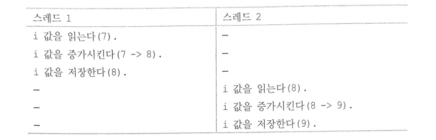

# Synchronization

## 동기화 기본 개념

### 위험 지역과 경쟁 조건

- 위험 지역(Critical section) : 공유 데이터에 접근하고 조작하는 코드 영역
    
    → 위험 지역에서 동시에 접근하는 것을 막으려면, 원자적으로 코드를 실행
    
    ⇒ 위험지역 전체를 하나의 동작처럼 처리해 실행중에 방해받는 일 없이 마무리
    
- 경쟁 조건(race condition) : 두 스레드가 서로 먼저 가려고 경쟁하는 듯한 상황
- 동기화(Synchronization) : 동시 실행을 안전하게 처리하고, 경쟁 조건이 발생하지 않게 하는 작업

### 보호 장치가 필요한 이유

e.g. 위험 지역이 없어서 무결성이 깨지는 경우 : 동기화 없는 ATM

잔액이 100만원, 동시에 두 ATM에서 이 계좌로부터 100만원을 인출한다면?

→ 정해지지 않은 동작이 발생하거나, 둘 중 한 ATM에서는 출력이 불가능해야 하므로 출금 요청이 생기면 이를 원자적으로 처리해 다른 출금요청이 도달할 수 없게 방어.

e.g. 경쟁 조건 예시 : 전역변수 값 증가

전역변수 하나를 두 스레드가 동시에 1 증가시킨다면?

<이상적인 경우>

<예기치 못한 경우>

대부분 프로세서는 이를 방지하기 위해 변수 하나의 값을 읽고 증가시킨 후, 저장하는 과정을 하나로 처리하는 명령어 존재(그게 뭔지?). 이런 명령을 원자적 명령(atomic instruction) 이라고 함.

<원자적 명령 수행 결과, 스레드간 순서 바뀔 수 있음>

## 동시성 문제

### 동시성의 원인

사용자 공간의 프로세스들은 스케줄러에 의해 선점될 수 있으므로 동기화가 필요

→언제라도 프로세스가 선점되고, 다른 프로세스가 스케줄링 될 수 있기 때문에, 프로세스가 위험 지역을 실행하고 있는 중에도 타의에 의해 선점되는 일이 벌어질 수 있음.

만약, 새로 스케줄링된 프로세스가 같은 위험 지역에 들어가게 된다면?
(e.g. 프로세서 할당이 끝난 프로세스와 바로 이어서 새로 할당받은 프로세스가 같은 공유 메모리를 조작하는 경우)

1. 경쟁조건 발생 가능
2. 여러 단일 스레드 프로세스가 파일을 공유하는 경우에도 같은 문제 발생

위와 같이 두 작업이 실제로 동시에 일어난다고 항상 확정할 수 없지만, 서로 중첩되어 실행될 가능성이 남아있는 경우, 이대 발생하는 동시성 문제 : 유사 동시성(peudo-concurrency)

진정한 동시성(true-concurrency) : 대칭형 다중 프로세서 장비에서 두 프로세스가 실제로 정확히 같은 시간에 위험 지역을 실행하는 경우 생기는 동시성 문제.

- 대칭형 다중 프로세서 장비 : 대칭형 다중 처리(Symmetric MultiProcessing : SMP)라고도 하는데, 두개 또는 그 이상의 프로세서가 한 공유 메모리공간을 사용하는 컴퓨터 아키텍쳐.

유사 동시성과 진정한 동시성은 원인과 과정이 다르지만, 같은 형태의 경쟁 조건을 발생시키므로 같은 방식의 보호 장치가 필요함.

커널에서 동시성 이슈가 발생하는 원인

- 인터럽트 발생 : 인터럽트는 비동기적으로 언제든 발생 가능하므로, 현재 실행중인 코드를 언제든 중단시킬 수 있음
- softirq, tasklet : 커널은 언제라도 softirq, tasklet을 스케줄링해서 현재 실행중인 코드를 중단시킬 수 있음
    - softirq, tasklet: 후반부 처리를 실행하는 단위
        - 두 개체의 차이 : 동일 실행 가능여부(softirq : 동일실행 가능, tasklet : 동일실행 불가)
- 커널 선점 : 리눅스는 선점형 스케줄러를 사용하므로 커널의 한 작업이 다른 작업을 선점할 수 있음
- 대칭형 다중 프로세싱 : 둘 이상의 프로세서가 동시에 커널 코드를 실행할 수 있음

## 락

### 락의 개념과 등장 배경

복잡한 자료구조를 공유할 때 경쟁 조건이 발생하면, 데이터 구조가 망가질 수 있음

e.g. 생산자-소비자 패턴에서, 작업물을 적재하는 중간 큐가 있고, 이 큐는 연결 리스트로 구현.

생산자 스레드가 작업 큐에 쓰기작업 진행 도중 소비자 스레드가 작업물 탐색을 작업 큐에 수행한다면, 정합성이 깨진 상태의 큐를 읽는 꼴이 될 수 있고, 한 작업물에 대해(=작업큐의 길이가 1일 때) 2개 이상의 소비자 스레드가 접근하여 작업물을 가져오는 연산을 수행한다면, 큐가 손상됨

→ 이를 한 스레드만 공유대상 자료구조를 조작하게 하는 방법으로 방지

⇒ 위 방식이 락(Lock)을 부여하는 방식

e.g. 락은 문의 자물쇠와 비슷하게 동작하고, 위험 지역이 방 안. 한 스레드가 방 안에 들어가면 자기가 가지고있던 자물쇠로 방 안에서 문을 잠그고, 그 방을 순전히 혼자서 사용. 방이 잠겨있는걸 알고, 들어가고자 하는 스레드들은 방 밖에서 대기. 들어간 스레드가 일을 모두 마치면, 가지고 있던 자물쇠를 풀고 챙겨서 방 문을 열고 나옴.

위 생산자-소비자 패턴에 락을 적용한다면?

→ 작업 큐에 요청을 추가할 때 마다 스레드가 락을 걸어서 작업 수행. 모든 요청을 안전하게 큐에 적용한 후에 락을 해제.

⇒ 락은 동시 실행을 방지하여 큐를 경쟁 조건으로부터 보호

(busy-waiting 방식으로 락이 풀리길 기다리는 스레드. 동시접근을 허용하지 않음)

락을 기다리는 두 방식

- busy-waiting : 리눅스에서는 spinlock 이라고도 하는데, 다른 스레드가 이미 락을 차지하고 있으면 계속 락이 풀렸는지 확인하면서 대기하는 방법.
- 락을 사용할 수 있을 때까지 태스크를 휴면 상태로 전환하는 방법

### 동시성 문제 대비의 필요성

공유 자원을 보호하기 위해 락을 구현하는 일은 어렵지 않지만, 실제 공유되는 데이터와 그에 해당하는 위험 지역을 식별하는 일은 어려움.(= 락의 구현은 쉽지만, 알맞은 장소에 적절하게 적용하는 건 어려움)

때문에 프로그램 설계부터 코드의 락을 적절히 설계 및 배치하여야 함

안전한 코드 분류 예시

- 인터럽트 핸들러의 동시 접근으로부터 안전한 코드 : 인터럽트 세이프
- 대칭형 다중 프로세싱의 동시성 문제로부터 안전한 코드 : SMP-세이프
- 커널 선점의 동시성 문제로부터 안전한 코드 : 선점-세이프

### 보호 대상 식별

락이 필요한 데이터 : 다른 곳에서 볼 수 있는 데이터는 전부 락이 필요할 수 있음

락이 필요없는 데이터 : 한 스레드에서만 접근 가능한 경우의 데이터(e.g. 스레드가 점유한 메모리 공간의 stack 영역의 데이터)

⇒ 락은 데이터에 적용되는 것이지 소스코드에 적용되는 것이 아님

## 락 사용시 고려사항

### 데드락

데드락(deadlock) : 모든 스레드가 다른 스레드의 락 해제를 기다리고 있지만, 이미 모든 자원에 락이 걸려있는 상태. 모든 스레드가 서로에 대해 대기중이므로, 이미 락을 걸어놓은 자원을 해제해줄 수 없음

→ 모든 스레드가 더 이상 진행할 수 없는 상태

- 셀프 데드락 : 실행 스레드가 이미 얻은 락을 다시 얻으려고 시도한 경우(자기 자신이 해제해야 같더라도 다시 락을 받을 수 있는데, 자신이 점유하면서 해제하지 않고 다시 그 락을 받으려는 경우)
- 죽음의 포옹(deadly embrace) or ABBA 데드락 : 2개의 스레드와 2개의 락이 있는 경우 발생. 서로가 서로의 락 해제를 대기하는 상태

이런 데드락을 회피하기 위한 규칙

- 순서에 맞춰서 락을 구현. 락이 중첩되는 경우에는 항상 같은 순서로 락을 획득. 또한, 이 순서를 기록해서 다른 스레드도 이 순서를 지키게 유도
- 기아현상(starvation) 방지. 코드가 항상 잘 종료하는지, 영원히 대기중으로 빠지지는 않은지 확인
    - 기아 현상(starvation) :  무한히 락이 풀리기를 기다리는 상태.
- 같은 락을 두 번 획득하지 말 것
- 시스템 자체를 단순하게 설계
    
    

둘 이상의 락을 동시에 얻는 경우, 항상 같은 순서로 얻어야 함. 

e.g. 각 이름에 해당하는 자료구조를 보호하는 cat, dog, fox 락이 있다고 가정

이 3개의 자료구조를 동시에 처리하는 함수가 있다면, 자료구조 사이에 데이터를 복사하는 일이 생길 수 있음(=안전하지 않은 쓰기작업). 이때 데이터 구조의 안전한 접근을 보장하기 위해서는 락을 사용해야 하는데, 한 함수가 cat, dog, fox 순으로 락을 획득했다면 다른 모든 함수도 똑같은 순서로 락을 획득하여야 한다. 

아래 도표는 이를 지키지 않을 경우 생길 수 있는 데드락

락을 해제할 때는 데드락과 큰 관련은 없지만, 락을 얻는 순서와 반대로 해제하는 것이 일반적

e.g. cat, dog, fox 순으로 얻었다면, fox, dog, cat 순으로 락을 해제

### 락 경쟁, 확장성

- 락 경쟁(=경쟁(contention)) : 현재 사용중인 락을 다른 스레드가 얻고자 하는 경우
    
    락 경쟁이 심하다 : 대기중인 스레드가 많다
    

(락을 얻는 횟수가 많다) or (락을 얻은 상태를 유지하는 시간이 길다) : 두 조건이 동시에 발생한 경우, 락 경쟁이 심하다고 정의할 수 있음.

경쟁이 심한 락은 시스템 병목현상을 일으켜 전체 성능을 저하시킬 수 있음.

하지만, 심한 락 경쟁 문제를 해결할 때도 당연히 동시성 보호 기능은 존재해야 함(락의 사용 의의)

- 확장성 : 시스템이 얼마나 잘 확장될 수 있는가를 나타내는 척도
    
    보통 OS에서 확장성은 프로세스의 개수, 프로세서의 개수, 메모리 용량의 상대적 성능 등 용량을 표현할 수 있는 모든 컴퓨터 구성 요소에 대해 확장성을 논할 수 있음.
    
    → 2.0커널부터 다중프로세서 지원이 도입됨에 따라, 확장성이 늘어난 만큼 동시성 보호 기능에 대한 도전도 많이 일어남
    
- 락의 세밀함 : 락이 보호하는 크기가 얼마나 세밀한가를 나타내는 척도
    
    → 락이 세밀하지 않다면 시스템 자료구조 전체와 같이 많은 양의 데이터를 보호
    
    ⇒ 너무 크면 쓸모없는 병목현상을 일으킬 수 있음
    
    → 락이 세밀하다면 큰 자료구조의 개별 항목 하나하나같은 작은 양의 데이터 보호
    
    ⇒ 락이 너무 작으면 도처에 여럿 배치되어 전체 시스템 성능을 낮출 수 있음
    
    → 세밀도가 얼마나 적정한가에 대한 평가 지표는 없음