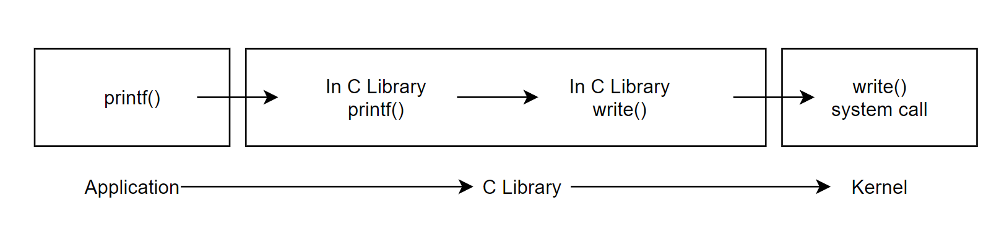

# System Call

# 목차

## 시스템 콜 정의

## 시스템 콜 제공

## 시스템 콜 세부구성

## 시스템 콜 구현

## 시스템 콜 정의

시스템 콜 : 하드웨어와 사용자 공간 프로세스 사이에 있는 계층(layer)

계층의 역할

1. 사용자 공간에 하드웨어 인터페이스를 추상화된 형태로 제공
    
    e.g.) 파일 입출력 시 애플리케이션은 디스크나 저장 매체의 형식이나 파일시스템 형식 같은 것을 신경 쓸 필요가 없음.
    
2. 시스템 콜은 시스템 보안 및 안정성 제공
    
    e.g.) 커널이 시스템 자원과 사용자 공간 사이에서 중재자 역할을 하기 때문에, 커널이 접근 권한과 같은 기준을 적용해 통제할 수 있음.
    
3. 사용자 공간과 기타 시스템 사이에 계층을 둠으로써, 프로세스별 가상 시스템 환경을 제공할 수 있음.
    
    e.g.) 시스템 콜로 가상화된 커널 주소 공간에(권장하지 않지만) 쓰기 가능
    

LINUX의 시스템 콜은 사용자 공간에서 커널과 상호작용할 수 있는 유일한 수단(트랩 제외)

- 트랩? : 소프트웨어가 생성한 인터럽트. 이를 이용해 산술 연산의 오류를 포착할 수 있음. 발생하는 시점이 프로세스의 특정 지점이라는 부분에서, 동기적 인터럽트라고 분류.
    
    e.g.) 0으로 나누기, 페이지 폴트 등
    

x86 시스템에는 시스템 콜이 약 335개정도 존재하고, 아키텍처별로 고유 시스템 콜이 있을 수 있어 일일히 소개하지 않음.

## syscall

리눅스에서는 system call을 syscall이라고 줄여서 부름. 시스템 콜을 사용할 경우, 인터페이스에 정의된 함수를 불러서 사용. 이때, 함수에는 0개 혹은 하나 이상의 인자를 받음(하단 추가설명). 

e.g.) 파일에 데이터를 기록하거나, 지정 포인터에 특정 데이터를 저장하는 동작 등

시스템 콜은 간혹 성공과 실패 정보를 제공하는 long 타입 값을 반환하는 경우도 있음.

e.g.) getpid()라는 시스템 콜은 현재 프로세스의 pid값에 해당하는 정수 반환

long 타입 이유 : 64비트 아키텍처와 호환성을 보장해주기 위함

시스템 콜은 정의된 특정 동작만 수행하고, 이 정의는 굉장히 간단하게 명시됨

e.g.

SYSCALL_DEFINE0 (getpid)

{

return task_tgid_vnr(current);    //current→tgid 값 반환

}

각 구문별 의미

SYSCALL_DEFINE0 : 인자가 없는(DEFINE 뒤에 0) 시스템 호출을 정의하는 매크로

getpid : 앞에 sys_가 붙고, 이 시스템 콜 매크로의 이름이 될 부분

task_tgid_vnr(current) : current(currnet 매크로의 결과)가 가진 ThreadGroupID를 리턴하는 함수

왜 pid를 구하는데 tgid를 리턴하냐?

일반 프로세스는 TGID와 PID가 같음. getpid()를 호출해도 동일 스레드 그룹의 스레드는 모두 같은 pid를 가지므로, tgid를 리턴해도 결과적으론 pid를 얻는 셈.

- 함수 정의로는 구현 내용에 대해 아무것도 알 수 없음
- 커널은 시스템 호출이 의도하는 동작을 제공해야 하지만, 결과만 정확하면 구현은 어쩌든 상관 없음

위 소스는 아래 매크로처럼 확장됨

asmlinkage long sys_getpid(void)

구문별 의미

asmlinkage : 해당 함수의 인자를 스택에서만 찾으라고 컴파일러에게 명시하는 문법. 모든 시스템 콜은 이 지시자가 사용됨.

return type = long : 32비트 시스템과 64비트 시스템의 호환성을 유지하기 위함.

sys_ : 시스템 콜의 이름에 항상 붙는 접두어.

e.g. bar()시스템 콜 : sys_bar()

대부분 시스템 콜은 호출 번호와 함께 하나 이상의 매개변수 전달. 어떻게해서든 예외 발생 과정에서 매개변수를 사용자 공간에서 커널 공간으로 전달.

→ eax 레지스터 사용법과 같은 방식으로(레지스터에 매개변수를 저장하는 방식, 후위에 추가설명) 전달함.

## 시스템 콜 제공

app은 일반적으로 시스템 호출을 직접 사용하지 않고, 사용자 공간에서 구현된 API를 이용. 

- API : Application Programming Interface의 약자. 컴퓨터와 프로그램 사이의 연결. 대표적으로 POSIX가 있음.
    - POSIX : Portable Operating System Inteface의 약자. 서로다른 UNIX OS의 공통 API를 정리, 이식성이 높은 유닉스 응용 프로그램을 만들기 위해 IEEE가 책정한 인터페이스 규격

app이 사용하는 인터페이스와 커널이 제공하는 인터페이스는 직접적 연관 없음.

- 시스템에 따라 내부 구현이 전혀 달라도 같은 형태의 API를 제공함으로써, 플랫폼 독립성을 확보하기 위함.

리눅스의 시스템 콜 인터페이스는 다른 유닉스 시스템과 마찬가지로, C 라이브러리 형태로 제공.  

- 여기서 C 라이브러리 : 표준 C 라이브러리와 시스템 콜 인터페이스 등, 유닉스 시스템의 주 API가 모두 구현되어 있음.
- 따라서, 프로그래머는 API만 집중하면 되고, 커널은 시스템 콜에만 집중(어떤 시스템 콜이 자주 사용될지, 시스템 콜의 유연함을 어떻게 유지할 것인지).

모든 유닉스 인터페이스의 공통 목표 : 정책이 아닌 방식을 제공하라(Provide mechanism, not policy)

- 유닉스 시스템 콜은 아주 일반적인 형태로 제공됨. 어떻게 쓸지는 커널이 알 바 아님.

## 사용자 공간에서 시스템 콜

일반적으로 C 라이브러리가 시스템 호출 방법 제공

→ app은 표준 헤더 파일에서 함수 정의를 가져다 쓰고, C 라이브러리와 링크해 시스템 호출 사용

리눅스는 시스템 콜에 접근하는 매크로를 직접 제공

- 매크로 원리 : 레지스터에 내용을 채워넣고 예외를 발생
- 매크로 이름 : _syscalln() (여기서 n은 0~6사이 값이 들어감)
    - 이름규칙이 생긴 이유 : 레지스터에 값을 채워야 할 매개변수의 개수를 알아야하므로, 이런 방식으로 시스콜에 전달하는 매개변수 개수 지정
- 매크로 예시 :
    
    long open(const char *filename, int flags, int mode)
    
    라이브러리 지원이 없을 경우, 이 시스템 콜을 사용하는 시스템 매크로는 아래와 같음
    
    #define __NR_open 5
    
    _syscall3(long, open, const char *, filename, int, flags, int, mode)
    
    → 이 매크로를 app 안에 배치하면 app은 open()시스템 콜 사용 가능
    

각 매크로는 2 + 2 * n 개의 인자를 가지는데, 

첫 번째 인자는 시스콜의 반환형, 두 번째는 시스템 콜의 이름 : +연산의 좌변

그 다음은 시스템 콜이 사용하는 각 매개변수의 타입과 이름 짝 : + 연산의 우변 중 n의 계수

__NR_open 매크로는 <asm/unistd.h> 파일에 있는 시스템 콜 번호

## 알맞은 시스템 콜 찾기

사용자 공간의 app이 예외를 발생시켜 커널 모드에 돌입했다고 쳐도, 어떻게든 시스템 콜의 번호를 커널에 전달해야 시스템 콜이 실행됨.

x86 아키텍처에서는 eax 레지스터를 이용해 시스콜 번호를 커널에 전달함.

- eax 레지스터 :  (Extended Accumulator Register) : 산술, 논리 연산을 수행하고, 반환값을 저장하는 레지스터. 호출 함수의 성공 실패 여부를 빠르게 알 수 있음(반환값을 쉽게 얻어올 수 있기 때문).

사용자 공간에서 커널이 진입하기 전에 eax 레지스터에 원하는 시스템 콜의 번호를 명시하고, 시스템 호출 핸들러가 eax 레지스터에서 값을 읽어서 알맞은 시스템 콜 실행.

- NR_syscalls? : Numeric Refernece : 유효한 정수값인지 체크하는 레퍼런스

## 시스템 콜 세부구성

## 시스템 콜 번호

시스템 콜 핸들러는 주어진 시스템 콜 번호를 NR_syscalls 값과 비교해 유효한지 확인(by system_call())

리눅스의 모든 시스템 콜에는 고유 번호가 할당됨. 특정 시스템 콜을 참조하는 데 사용.

사용자 공간 프로세스가 시스템 콜을 실행할 때, 시스템 콜 번호를 통해 어떤 시스템 콜을 사용할지 알 수 있음(이름으로 참조하지않음).

시스템 콜 번호의 특징

- 한번 할당되면 변경 불가
    - 만약 변경되면, 이미 컴파일된 app이 실행되지 않음
- 시스템 콜이 제거되면, 해당 시스템 콜이 번호를 영구결번처리.
    - 만약 재사용하면, 이전에 컴파일된 코드가 엉뚱한 시스템 콜을 부를 수 있음

리눅스는 ‘구현되지 않은’ 시스템 콜을 뜻하는 sys_ni_syscall() 함수 제공.

- sys_ni_syscall() : 유효하지 않은 시스템 호출이라는 뜻의 -ENOSYS 오류코드 반환

어쩌다 시스콜이 제거되거나, 사용할 수 없는 상황이 발생할 경우 이 함수를 이용해 ‘공백 메우기’를 할 수 있음

커널은 모든 시스템 콜 목록을 sys_call_table이라는 곳에 저장. 아키텍처별로 따로 존재함. 여기서 유효한 시스템 콜 마다 고유 번호 할당.

## 시스템 콜 핸들러

사용자 공간의 app은 어떻게든 실행하고자 하는 시스템 호출이 있다는 것을 커널에게 알리고, 시스템을 커널 모드로 전환해야 커널이 app 대신 시스템 콜을 수행함.

이때, 사용자 공간의 app이 커널에 신호를 보내는 방법으로 소프트웨어 인터럽트 사용.

소프트웨어 인터럽트 : 예외가 발생하면 시스템은 커널 모드로 전환되는데, 이때 예외처리기가 실행됨. 

소프트웨어 인터럽트의 경우에선, 시스템 호출 핸들러가 예외 처리기가 됨.

이 인터럽트가 발생하면, 커널 모드로 전환되고 시스템 콜 핸들러 실행.

시스템 콜 핸들러가 어떻게 호출되든, 사용자 공간에서 커널로 진입하려면 어떤 방법으로든 예외를 발생시켜서 진입해야 함.

시스템 콜 핸들러는 system_call() 함수로 구현됨. 

e.g) x86-64는 entry_64.s 파일에 어셈블리어로 구현됨.

## 시스템 콜 구현

### 구현 순서

시스템 콜을 구현할 때, 가장 먼저 목적을 정의해야 함.

- 시스템 콜은 정확히 1개 목적이 있어야 함(복수개 목적은 권장하지 않음)
    
    e.g.) ioctl() : Input/Output control 하는 함수인데, 이 함수는 디바이스 드라이버와 통신하기 위한 함수. 이 경우, 어떤 장비가 연결될 지 모르므로 예측할 수 없는 문제가 다량 발생할 수 있어 커널의 안정성이 깨질 수 있음
    
- 시스템 콜의 의미와 동작은 한번 정하면 다시 바꿀 수 없음.
    
    번호를 바꾸지 못하는 것과 같은 이유
    
- 시스템 콜은 높은 이식성을 제공하기 위해 상위 호환성도 고려해야 함.
    
    이를 해결하기 위해 대부분 시스템 콜에서 플래그 인자 사용.
    
    플래그 인자 : 하위 호환성을 깨거나, 새로운 시스템 콜을 추가하지 않고 새 기능이나 옵션을 추가하는 데 사용하는 인자.
    
    상위 호환성을 보장하기 위해 앞으로 바뀔 내용에 대비하여 만들어야 함.
    
    → 유닉스의 모토와 동일
    

두 번째로, 매개변수의 유효성 검증

- 커널 공간에서 실행되므로, 아무 제약 없이 사용자가 잘못된 입력값을 커널로 전달할 수 있다면, 시스템 보안과 안정성이 위협받을 수 있음.
    
    e.g.) 파일 입출력 시스템 콜은 파일 서술자가 유효한지 확인해야 하고, 프로세스 관련 시스템 콜은 넘겨받은 PID 값이 유효한지 확인해야 함
    
- 사용자가 제공한 포인터의 유효성 확인
    
    e.g.) 읽을 권한이 없는 영역의 포인터를 시스템 콜에 전달한다면, 프로세서는 커널을 속여 허가되지 않은 영역도 액세스할 수 있음.
    
    - 시스템은 포인터의 유효성을 확인하기 위해, 아래 내용을 필히 체크해야 함
        - 포인터는 사용자 공간의 메모리 영역을 가리키고 있어야 함(커널공간 접근 불가)
        - 포인터는 프로세스 주소 공간의 메모리 영역을 가리키고 있어야 함(다른 프로세스의 데이터를 읽으면 안됨)
        - 읽는 경우라면 해당 메모리가 읽기 가능해야 하고, 쓰기 경우라면 해당 메모리가 쓰기 가능해야 함(동작에 따른 권한이 프로세스에 있어야됨)

마지막으로, 권한 유효성 확인

- 특정 자원에 대해 특정 권한을 가졌는지 확인. 유효한 자격 플래그와 함께 capable() 함수 호출, 주어진 자격이 있는 경우 0이 아닌 값을 반환하고, 그렇지 않으면 0을 반환
    
    e.g.) capable(CAP_SYS_NICE) 호출, 호출한 대상이 다른 프로세스의 나이스 값을 변경할 수 있는 권한이 있는지 확인. 모든 자격과 권한 플래그는 <linux/capability.h> 파일 참고.
    

커널은 확인 작업이 끝나고, 원하는 내용을 사용자 공간으로 가져오는 2가지 방법 제공

1. 사용자 공간에 쓰기 작업을 하기 위해 copy_to_user(arg1, arg2, arg3) 함수 제공.
    1. arg1 : 프로세스 주소 공간의 목적지 메모리 주소
    2. arg2 : 커널 공간의 원본 포인터
    3. arg3 : 복사할 데이터의 바이트 크기
2. 사용자 공간에 읽기 작업을 위해 copy_to_user()와 유사한 copy_from_user(arg1, arg2, arg3)제공
    
    →세 번째 인자가 지정한 바이트 수 만큼 두 번째 인자가 지정한 위치에서 읽어 첫 번째 인자가 지정한 위치에 저장
    

두 함수 모두 오류가 발생하면 복사에 실패한 바이트 수 반환. 성공하면 0 반환.

보통 오류가 발생하면 -EFAULT 반환

확인 및 사용자 공간에 전달하는 방법을 정의하면, 마지막으로 시스템 콜 테이블에 내용을 추가.

- 시스템 콜을 지원하는 모든 아키텍처에 대해 각 아키텍처별 시스템 콜 테이블의 맨 끝단에 항목을 추가해주어야 함.
    
    e.g.) 목록의 10번째 항목에 추가한다면, syscall 번호 9번 할당
    
- 지원하는 모든 아키텍처의 시스콜 번호를 <asm/unistd.h> 파일에 정의
- 시스콜을 커널 이미지로 컴파일.
    - 커널 이미지? : 커널이 하나의 파일로 디스크에 저장되어있는 것. 커널의 내용을 서술하는 파일.

## 시스템 콜 컨택스트

시스템 콜에 의해 사용자 구간 프로세스가 커널 구간으로 진입한 경우, 이 프로세스는 휴면 상태가 될 수 있으며 완전히 선점 가능하다.

e.g.) 시스템 콜이 실행 중 대기 상태가 되거나, 명시적으로 schedule() 함수를 호출하는 경우

→ 휴면 상태가 될 수 있다는 것은, 시스템 콜이 커널 대다수 기능을 사용할 수 있다는 의미(내일 7장에서 부연설명 있을 예정). 

→ 선점 가능하다는 것은, 새 작업이 같은 시스템 콜을 사용할 수 있다는 의미. 따라서 시스템 콜은 재진입이 가능해야 하고, 이때 보호 작업이 필요. 이는 9, 10장에서 설명.

시스템 콜이 끝나고 반환되면, 제어권이 system_call() 함수로 이관. 이 함수는 사용자 공간으로 프로세스를 다시 전환시켜 사용자 프로세스의 실행이 재개됨.

## 추가 조사

### 소프트웨어 인터럽트

인터럽트 내용 설명시 추가될 예정

## syscall 매크로 정의 위치

참고자료 : [https://yuldangs-sosolife.tistory.com/entry/kernel에-system-call-추가ubuntu](https://yuldangs-sosolife.tistory.com/entry/kernel%EC%97%90-system-call-%EC%B6%94%EA%B0%80ubuntu)

### EAX 레지스터

정의 :  (Extended Accumulator Register) : 산술, 논리 연산을 수행하고, 반환값을 저장하는 레지스터. 호출 함수의 성공 실패 여부를 빠르게 알 수 있음(반환값을 쉽게 얻어올 수 있기 때문).

→ 왜 더 빠른가? : 어셈블리 언어 레벨에서 컨트롤하는 레지스터이므로, C같은 하이레벨 언어에 비해 사용하는 명령 클럭이 더 적음. 또한, 함수의 환값이 EAX레지스터에 저장되기 때문에 EAX 레지스터를 참조하여 호출 함수의 성공, 실패 여부를 확인할 수 있음.

(의미상 rax와 eax는 같음. rax는 64bit 레지스터, eax는 32bit 레지스터. 크기의 차이

(RAX(64bits) - EAX(32bits) - AX(16bits) - AL(8bits) - AH(8bits)

사칙연산 명령어에서 자동으로 사용되는 리턴 레지스터, 시스템 콜의 실질적인 번호를 가리키는 레지스터

### 시스템 콜 호출시 시스템 스코프 이동 블럭 다이어그램

(1) : 제공된 라이브러리 내 함수 호출

(2) : read()의 래퍼 함수가 동작

→ 정의된 API에 의거한 시스템 콜 핸들러 함수를 찾음

⇒ 시스템 콜 번호와 시스템 콜 핸들러 함수 목록이 POSIX 규약에 명시되어 있음 - A

→ A 작업을 통해 알게된 시스템 콜 번호를 EAX 레지스터에 명시하고, 시스템 콜 핸들러 함수를 호출해 커널 모드 진입 - B

(3) : 시스템 콜 핸들러 함수는 위 B 과정에서 명시된 EAX 레지스터를 참조하고, 해당되는 시스템 콜 함수가 정의된 “커널 공간의 메모리 주소”를 찾아가 시스템 콜 실행

(4) : 시스템 콜이 종료되면, 실행 권한이 다시 시스템 콜 핸들러로 돌아감

(5) : 필요한 경우에 한해, copy_to_user() 작업이나 copy_from_user() 등 작업(리턴값이 없거나, 읽고 쓰는 등 유저 레벨과 상호작용할 필요가 더 없을 경우 e.g. 모니터에 출력하고 끝)을수행하여 다시 유저 공간으로 실행 권한 넘김

(6) : 래퍼 함수도 동작을 모두 마쳤으므로, 다시 실행 권한이 유저레벨 프로세스로 돌아감.

- 시스템 콜 테이블 구성 : 시스템 콜 번호 / 시스템 콜 핸들러 / 시스템 콜 위치로 구성.
    
    e.g.
    
    
    
    매핑 테이블 : [https://blog.rchapman.org/posts/Linux_System_Call_Table_for_x86_64/](https://blog.rchapman.org/posts/Linux_System_Call_Table_for_x86_64/)
    

### sys_ni_syscall()

단순하게, 유효하지 않은 시스템 콜이라면 -ENOSYS를 반환.

위 소스는 /Kernel/sys_ni.c중 일부 발췌

출처 : [https://elixir.bootlin.com/linux/latest/source/kernel/sys_ni.c#L20](https://elixir.bootlin.com/linux/latest/source/kernel/sys_ni.c#L20)

### capable() 리턴 정보

약 34가지 존재.

[https://sites.uclouvain.be/SystInfo/usr/include/linux/capability.h.html](https://sites.uclouvain.be/SystInfo/usr/include/linux/capability.h.html)