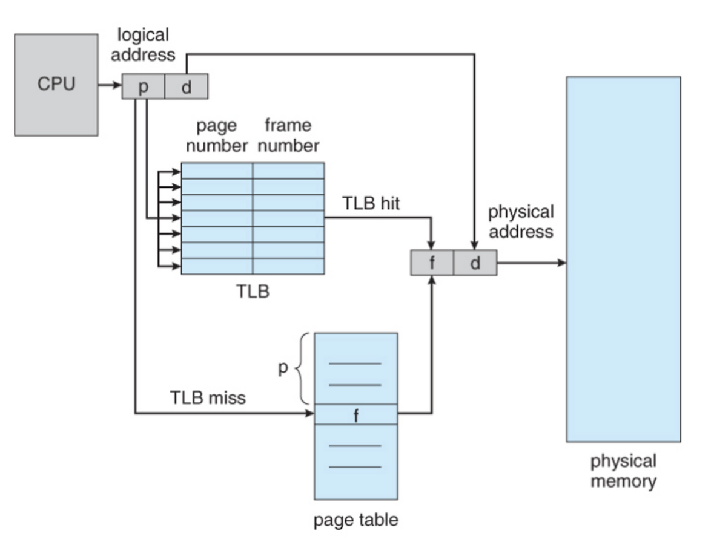

# TLB

# 정의

## TLB(Translation Look-aside Buffer)

가상 메모리 ↔ 물리 메모리 변환 과정에서, 변환 속도를 높이기 위해 사용되는 캐시

→ 이 또한 고속 캐시 메모리이므로, **하드웨어 부품** 으로 존재함.

L1캐시 급의 속도를 나타내고, 보통 32~64, 128개의 엔트리를 저장할 수 있음

# 등장 배경

가상 메모리를 물리 메모리로 변경해주는 페이지 테이블은 메인 메모리에 저장됨.

→ 가상 메모리 시스템을 사용하고있는 아키텍처에서는, 프로그램이 메모리에 직접 액세스하려면 접근이 최소 2번 필요하다는 뜻

1. 프로세서가 페이지 테이블에 접근해서 가상 메모리에 대응하는 물리 메모리 주소를 알아냄
2. 위 1.에서 획득한 물리 메모리 주소에 직접 접근해서 연산 수행

이때, 페이지 테이블에 접근하는 것 역시 한 프로세스에서 할당받아둔 메모리 내에서만 접근하기 때문에, 지역성을 띨 확률이 높음

- 지역성(Locality) : 메모리 내 서로 인접해서 저장되어있는 데이터에 대해 참조 경향이 높다는 특성과(=공간적 지역성), 한번 참조된 메모리는 다시 참조되는 경향이 높다는 특성(=시간적 지역성)

⇒ 따라서, 최근 참조한 메모리 변환 테이블은 다시 참조될 가능성이 높으므로, 이 테이블의 일부를 떼어 캐시에 저장하자는 취지.

# 동작 원리

- 각 약칭의 의미

| 표기 | 의미 | 표기 | 의미 |
| --- | --- | --- | --- |
| p | 페이지 번호 | d | 페이지 내부 위치(=offset) |
| f | 프레임 번호 | TLB | 캐싱된 페이지 테이블 |
| page table | 메모리에 적재된 페이지테이블 | physical mm | 물리적으로 탑재되어있는 메모리 |
| logical add | 가상/논리적 주소 | physical add | 물리적 주소 |
- 동작 순서
    1. CPU가 논리적 주소를 생성 및 참조
    2. TLB에서 접근하려는 페이지 번호가 프레임 번호로 매핑되어있나 검색
        1. 만약 존재한다면(=TLB hit라면) ?
            1. TLB에서 프레임 번호 f를 읽어옴
            2. CPU가 가지고있던 offset d와 결합해서 실제 물리적 주소 생성(f + d)
            3. 해당 물리주소로 실제 메모리에 접근
        2. 만약 존재하지 않는다면(=TLB miss라면) ?
            1. 메모리에 적재된 페이지 테이블로 접근해 p에 대응하는 f를 찾음
            2. 방금 읽은 매핑정보를 TLB에 새로 저장(캐시 업데이트)
            3. CPU가 가지고있던 offset d와 결합해 실제 물리적 주소 생성(f + d)
            4. 해당 물리주소로 실제 메모리에 접근

# TLB Data Lifecycle

## 생성

TLB Miss가 발생한 경우 캐시에 생성됨

→ 물리 메모리에 저장되어 있는 page table의 참조 내용을 TLB로 저장하는 과정에서 생성

## 활용

아래 경우에 해당하는 상황이 아니라면 계속해서 캐시 내부에 존재하고있음

1. Context Switching이 발생하는 경우
2. 현재 TLB를 참조중인 프로세스가 캐시 용량 이상으로 페이지를 많이 참조하고 있는 경우

## 삭제(=TLB flush)

일반적으로 Context switching이 발생하면 모든 TLB 자체를 밀어버리고 새로 저장

→ 각 프로세스는 고유한 메모리 공간을 가져야만 하기 때문. 프로세스를 전환하는 과정에서 새 프로세스 소유의 주소공간을 참조할 일이 없도록, 아예 TLB 내용 자체를 비워버리는 과정 수행

# Github 질문 목록

## 1. TLB를 쓰면 왜 빨라지나요?

→ 기존 방식대로 수행할 경우, 메모리 접근을 수행할 때 필연적으로 모든 프로세스는 2회 액세스를 거쳐야 함(페이지 테이블 참조 1회, 실제 물리주소 참조 1회)

따라서, 페이지 테이블 역시 지역성을 띠고 있으므로 페이지 테이블 일부를 캐싱해두면, 최초 1회 액세스 시간을 대폭 단축시킬 수 있음.

(실제 물리메모리에 액세스하는 시간 자체는 영향없음.)

## 2. MMU가 무엇인가요?

→ MMU : Memory Management Unit.

CPU가 메모리에 접근하는 것을 관리하는 **하드웨어 부품**

가상 메모리 주소를 실제 메모리 주소로 변환하고, 메모리 보호, 캐시 관리, 버스 중재 등 메모리 상태관리 등 전반을 모두 담당함.

앞서 언급했던 TLB 사용 방식의 주체가 곧 MMU.

위 사진은 실제 매킨토시2에 탑재되어있는 MMU 사진.

## 3. TLB와 MMU는 어디에 위치하나요?

→ 둘 모두 CPU 칩 안에 위치. MMU는 별도의 칩으로 존재했지만, 현대 CPU 아키텍처에서는 모두 프로세서 내부에 MMU를 내장하고 있음.

일반적으로 CPU 안에 MMU가, MMU 안에 TLB가 위치함.

## 4. 코어가 여러개라면, TLB는 어떻게 동기화할 수 있을까요?

→ TLB flush + Write-Iinvalidate와 유사한 방식으로 동기화 수행.

(정식 명칭은 TLB Shootdown(=TLB 무효화))

일반적으로 MMU는 코어 단위로 각각 존재하기 때문에 TLB 자체에 대해서는 원본 데이터가 수정되는 것이 아닌 이상 동기화를 해줄 이유가 없음.

하지만, 원본 페이지 테이블은 OS가 관리하는 물리 메모리에 위치하고 있으므로, 아래 상황이 발생하면 페이지 테이블이 수정되기 때문에 이 과정에서 동기화가 필요함

- 새로운 페이지 매핑 정보가 테이블 엔트리에 추가됨
- 특정 페이지에 대한 코어 당 권한이 변경됨
- 페이지 swap이 일어나 매핑 정보가 달라짐

“한 코어가 페이지 테이블 내용을 변경하면, 다른 코어의 로컬 캐시(=TLB 저장내용)는 더 이상 유효하지 않으므로 모두 무효화한다” 는 컨셉은 동일.

하지만, Write-Invalidate는 하드웨어적인 프로토콜에 의해 캐시를 flush하고 재지정하도록 지원하는 반면, TLB Shootdown은 InterProcess Interrupt를 발생시켜 소프트웨어적 프로토콜로 처리한다는 부분이 차이점.

⇒ 결론 : 페이지 테이블 정보가 달라지면, 이를 수정한 프로세서가 인터럽트를 발생시켜 모든 코어의 TLB를 수정하도록 알람 발생.

## 5. TLB 관점에서, Context Switching 발생 시 어떤 변화가 일어나는지 설명해 주세요.

→ TLB flush가 발생함.

모든 프로세스는 각각 독립된 메모리 주소를 가지고 있어야 하기 때문에, 의도하지 않은 참조가 발생하지 않도록 보장해주어야 함.

이를 위해 context switching 발생 시 TLB를 모두 초기화하고 다시 비어있는 상황부터 프로세스를 실행해 주어야 함.

## 참고 출처

https://blog.naver.com/kgr2626/222147205118

https://server-technology.tistory.com/450

http://ko.wikipedia.org/wiki/%EB%B3%80%ED%99%98_%EC%83%89%EC%9D%B8_%EB%B2%84%ED%8D%BC

https://developbear.tistory.com/80

https://wpaud16.tistory.com/entry/Arm-TLB%EB%9E%80-page-table-48bit-%EA%B0%80%EC%83%81-%EA%B3%B5%EA%B0%84-virtual-memory-ASID-TTBR

https://en.wikipedia.org/wiki/Memory_management_unit