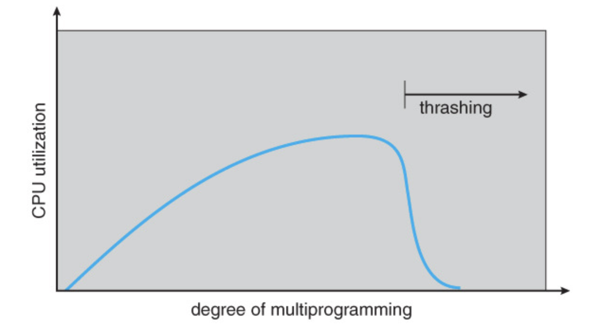

# Thrashing

## 정의

프로세스가 실제 계산(실행)보다 페이지 교체(page fault 대응) 등, 비생산적인 작업에 시간과 리소스를 소비해 성능이 저하되는 현상을 의미.

주로 시스템이나 프로그램이 지나친 수요에 압도당하거나, 워크로드를 효율적으로 처리할 리소스가 부족할 경우 발생.

앞서 발표의 예를 들면, CPU는 거의 일하지 않고 메모리와 디스크 사이 페이지 스와핑에 집중하느라 전체 throughput이 급격히 저하되는 상태를 말함.

→ Page Fault가 시스템 허용 수준을 넘어가는 현상

## 발생 원인

보통 Page fault가 지나치게 많이 발생할 경우 자연스럽게 수반되는 현상이므로, page fault의 발생 원인과 직결됨.

page fault의 발생 원인은 크게 2가지로 나눌 수 있음

### 1. 메모리 허용량보다 많은 프로세스를 실행하려는 경우

쉽게 말해서 메모리 용량보다 더 많은 양의 요구가 발생하는 경우를 의미.

많은 프로세스 중 일부만 메모리에 올라가고, 나머지는 보조기억장치에 스와핑되고, 이런 프로세스들고 스케줄링이 계속되기 때문에 page fault 가능성이 비약적으로 높아짐

### 2. 스케줄러가 CPU usage만 보고 새 프로세스를 추가하려고 할 경우

기본적으로 Thrashing이 발생하면 CPU가 실제 연산에 사용하는 시간을 희생해야 하기 때문에, 전체 throughput 단위로 본다면 CPU usage는 떨어진 것 처럼 보임

→ Thrashing의 발생 여부를 떠나서, 실제로 CPU가 실행한 결과물의 총량이 줄어들었기 때문

이 경우, 스케줄러는 Thrashing 발생 여부를 알 방법이 없으므로 CPU가 idle상태라고 오해해 새 프로세스를 적재할 수 있음. 이는 위 발생원인 1. 을 야기하며, 악순환에  빠질 위험이 생김

## 파급 효과

1. CPU는 page swap-in 을 대기하느라 idle 상태로 머무르는 시간이 길어짐. 이는 사용자 입장에서 마치 컴퓨터가 멈춘 것 처럼 보일 수 있음.
2. 디스크 스와핑 폭증으로 번지기 때문에, 보조기억장치의 수명 단축에 직접적인 악영향을 줌
    1. HDD의 경우 machine arm의 헤드 이동이 끊임없이 발생하므로, 디스크의 물리적 마모로 인한 수명 단축을 야기할 수 있음
    2. SSD의 경우, SSD 특성상 쓰기작업 반복에 취약하므로 쓰기 수명 감소를 야기할 수 있음
3. thrashing 상태에서는 페이지 폴트 인터럽트가 점차 많이 발생하기 때문에, 커널이 계속 Page fault handler를 호출해 커널 안정성을 급격히 하락시킴
4. 너무 잦은 page fault로 인해 cache가 사실상 무의미해지고, 이는 TLB도 무용지물로 만들어 cache hit ratio가 거의 0으로 수렴. CPU의 고급 자원을 아예 활용하지 못하는 상태에 빠짐
5. RTOS, 임베디드, 서버/클라우드 인프라에서는 서비스 품질 자체, 나아가 안전 문제도 야기할 수 있음

## 해결책

가장 직관적인 해결책은 할당해줄 메모리 블럭 개수, 또는 블럭 용량에 상한을 두는 방식

(정해진 개수의 프로세스만 메모리에 올라올 수 있도록 제한하는 방식)

하지만, 이 경우 메모리 단편화를 필연적으로 야기하기 때문에 의미있는 방식이라고 보기 어려움

따라서, 메모리 지역성(Locality)을 활용해 프로세스가 필요로 하는 메모리 용량의 100%를 주는 것이 아니라, 많이 참조할 가능성이 높은 일부분만 제공하는 방식으로 해결하는 것이 근대 OS의 주류 방식

→ 이때, ‘지역성의 영향을 받는 일부 페이지’를 Working set(=작업 공간) 이라고 하며, 이를 기반으로 메모리를 할당하는 구조를 Working set model 이라고 부름.

위 사진은 cpu가 실제로 메모리에 어느 부분을 자주 참조하는지를 시각화한 그래프.

가로축은 프로세스가 진행된 시간을 의미하고, 우측으로 갈수록 프로그램이 더 많이 실행된 시점을 의미.

세로축은 주소 공간을 의미하며, 프로그램이 직접 접근한 메모리 위치를 나타냄.

그래프의 검은 점은 프로그램이 동작한 시점에 어느 메모리를 참조했는지를 나타내고, 검은 부분의 면적이 많은 부분일수록 자주, 오래 참조했다는 것을 의미함.

### Working Set Model

위 그래프에서 볼 수 있는 지역성을 기반으로 동작하는 메모리 관리 방법. 프로그램이 현재 실행중인 내용을 기반으로, 지역성을 고려해 이전에 실행된 일정 부분만 메모리에 올리는 방식.

이때, “메모리에 올라간 페이지 집합”을 working set이라고 하며, working set을 추정하고자 관찰하는 “이전 참조 구간”을 “working set window” 라고 부름.

→ working set은 실제 사용하는 페이지 집합이고, working set window는 그 집합의 크기를 측정하기 위한 관찰 범위

이처럼 프로그램의 특정 부분은 지역성을 강하게 띠게 되며, 이 구간에 따라 메모리 프레임을 할당한다면 page fault가 특정 부분에 몰려서 발생할거라 기대할 수 있음. 

아랫부분 그래프에서, page fault 수준이 올라가는 부분이 working set window가 이동 및 할당되는 지점을 의미함.

이동 후 지역성이 유효한 시간 동안은 page fault가 많이 발생하지 않을 수 있음.

단, working set의 추적 및 window 사이즈 설정이 모호하고, 참조 페이지를 유지 및 관리하는 일 자체도 오버헤드이므로 이 역시 최적의 해답이라고 보긴 어려움.

최근엔 리소스 사용량을 추적해 Thrashing의 초기 징후를 감지하거나, ML(Machine Learning) 기법을 사용해 예방 조치를 트리거하는 방식이 사용되는 추세

→ 메모리 사용량, 디스크 I/O 속도, page fault ratio 등 사용량을 관찰하면 징후를 감지하는 일 정도는 가능.

→ 이 관찰정보를 분석하고 Thrashing 지표를 탐지하는 방식으로 ML을 적용한다면, 발생하기 직전의 징후를 포착해 워크로드 분산 등 예방 조치 발동 가능

⇒ 보통 로드밸런싱, 워크로드 마이그레이션 등을 적용해 리소스 할당을 동적으로 조정하는 전략이 예방 조치로서 사용됨

## 참고 출처

https://www.lenovo.com/kr/ko/glossary/thrashing/?orgRef=https%253A%252F%252Fwww.google.com%252F&srsltid=AfmBOoofFMH3auZmppWDMiugUgSICxzXhbKVE3JvadeXYkdD2iwUZVuj

https://charles098.tistory.com/117

https://swingswing.tistory.com/143